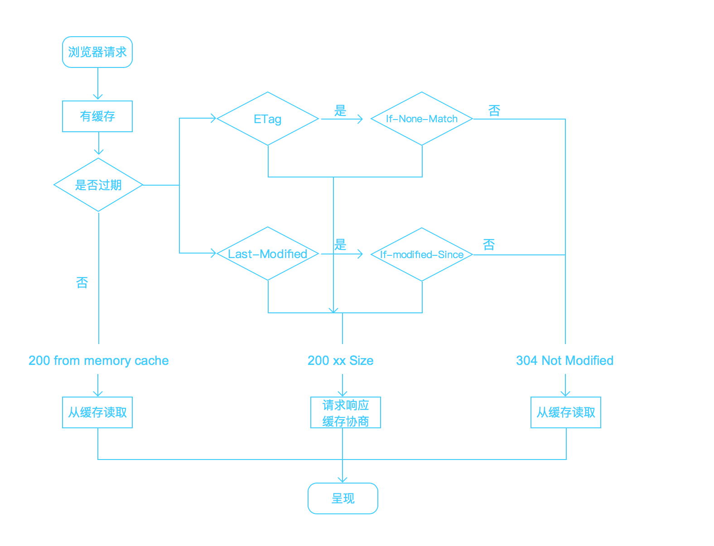
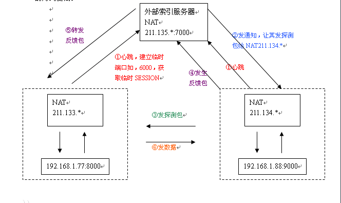
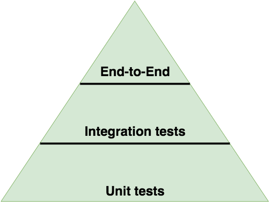

# web-questions


> 不断更新中…… 欢迎PR 

>创意共享 - 转载请注明出处 😉 🐳

> 总体来说，前端开发涉及如下技术：


- [基础基础](#1)

    - [HTML/CSS](#1.1)

    - [JavaScript](#1.2)

    - [网络](#1.3)

- [编程能力](#2)

    - [数据结构和算法](#2.1)

    - [正则表达式](#2.2)

- [扩展技术](#3) 
    
    - [Node.js](#3.1)

    - [ES6](#3.2)

    - [前端框架](#3.3)

    - [数据可视化](#3.4)
    
    - [性能优化](#3.5)
    
    - [前端工程](#3.6)

- [Web](#4)
    
    - [Web安全](#4.1)

    - [综合](#4.2)


<h1 id="1">基础基础</h1>


<h2 id="1.1">HTML/CSS</h2>


> `display:none`和`visibility:hidden`的区别？ 说出6种隐藏元素的方法？

```css
    display:none  隐藏对应的元素，在文档布局中不再给它分配空间，它各边的元素会合拢，就当他从来不存在。(不占据空间，涉及到了DOM结构，故产生reflow与repaint)

    visibility:hidden  隐藏对应的元素，但是在文档布局中仍保留原来的空间。(只产生repaint)
```

> CSS控制文字，超出部分显示省略号

```css
    overflow: hidden; 
    text-overflow:ellipsis; 
    white-space: nowrap;

    /*上面仅支持单行文本,多行呢？*/

    display: -webkit-box; 
    -webkit-box-orient: vertical; 
    -webkit-line-clamp: 3; 
    overflow: hidden;

    使用了WebKit的CSS扩展属性，该方法适用于WebKit浏览器及移动端；
```


> CSS实现三角形图标的原理

```css
    .caret {
      display: inline-block;
      width: 0;
      height: 0;
      margin-left: 2px;
      vertical-align: middle;
      border-top: 4px solid;
      border-right: 4px solid transparent;
      border-left: 4px solid transparent;
    }

    首先，需要把元素的宽度、高度设为0,然后设置边框样式。

    要做倒立三角形、向右的、或者向左的三角形，只需要为三角形底部设置边框，两腰边框透明即可。

```


> 渐进增强和优雅降级

    渐进增强 ：针对低版本浏览器进行构建页面，保证最基本的功能，然后再针对高级浏览器进行效果、

              交互等改进和追加功能达到更好的用户体验。

    优雅降级 ：一开始就构建完整的功能，然后再针对低版本浏览器进行兼容。


> CSS中` link` 和`@import `的区别是？

```css
    1.link属于HTML标签，而@import( CSS2.1 )是CSS提供的;

    2.页面被加载的时，link会同时被加载，而@import被引用的CSS会等到引用它的CSS文件被加载完再加载;

    3.import只在IE5以上才能识别，而link是HTML标签，无兼容问题;

    4.link方式的样式的权重 高于@import的权重.
```


> `position:absolute`和`float`属性的异同

```css
    共同点：对内联元素设置 float 和 absolute 属性，可以让元素脱离文档流，并且可以设置其宽高。
    
    不同点： float 仍会占据位置， absolute 会覆盖文档流中的其他元素。
```


> 说说你对页面中使用定位(position)的理解？

```
  position：static | relative | absolute | fixed | center | page | sticky
  默认值：static，center、page、sticky是CSS3中新增加的值。
(1)、static 
可以认为静态的，默认元素都是静态的定位，对象遵循常规流。此时4个定位偏移属性不会被应用，也就是使用left，right，bottom，top将不会生效。

(2)、relative 
相对定位，对象遵循常规流，并且参照自身在常规流中的位置通过top，right，bottom，left这4个定位偏移属性进行偏移时不会影响常规流中的其他元素。

(3)、absolute 
a、绝对定位，对象脱离常规流，此时偏移属性参照的是离自身最近的定位祖先元素，如果没有定位的祖先元素，则一直回溯到body元素。盒子的偏移位置不影响常规流中的任何元素，其margin不与其他任何margin折叠。
b、元素定位参考的是离自身最近的定位祖先元素，要满足两个条件，第一个是自己的祖先元素，可以是父元素也可以是父元素的父元素，一直找，如果没有则选择body为对照对象。第二个条件是要求祖先元素必须定位，通俗说就是position的属性值为非static都行。

(4)、fixed 
固定定位，与absolute一致，但偏移定位是以窗口为参考。当出现滚动条时，对象不会随着滚动。

(5)、center 
与absolute一致，但偏移定位是以定位祖先元素的中心点为参考。盒子在其包含容器垂直水平居中。（CSS3）

(6)、page 
与absolute一致。元素在分页媒体或者区域块内，元素的包含块始终是初始包含块，否则取决于每个absolute模式。（CSS3）

(7)、sticky 
对象在常态时遵循常规流。它就像是relative和fixed的合体，当在屏幕中时按常规流排版，当卷动到屏幕外时则表现如fixed。该属性的表现是现实中你见到的吸附效果。（CSS3）
```

传送门：[例题](https://www.nowcoder.com/profile/2851715/myFollowings/detail/3233480)


> 行内元素和块级元素的区别和他们的特点是什么？总结如下：

```
  块级元素会独占一行,默认情况下,其宽度自动填满其父元素宽度.

  行内元素不会独占一行,相邻的行内元素会排列在同一行里,直到一行排不下,才会换行,其宽度随元素的内容而变化.　另外

  块级元素可以设置width,height属性.行内元素设置width,height属性无效，它的长度高度主要根据内容决定.
  
  块级元素即使设置了宽度,仍然是独占一行.
  
  块级元素可以设置margin和padding属性.

  行内元素的margin和padding属性,水平方向的padding-left,padding-right,margin-left,margin-right都产生边距效果,但竖直方向的padding-top,padding-bottom,margin-top,margin-bottom却不 会产生边距效果.
  
  块级元素对应于display:block

  行内元素对应于display:inline
```


> 超链接访问过后hover样式就不出现了，被点击访问过的超链接样式不再具有hover和active了，解决方法是？

```
  a:link {} a:visited {} a:hover {} a:active {}
```


#### 如何将页脚固定在页面底部?


> 方法一：

  ```html
    <div id="container">

      <div id="header">Header Section</div>

      <div id="page" class="clearfix">

       页面容容部分

      </div>

      <div id="footer">Footer Section</div>

    </div>

    <!-- 实现这页脚永远固定在页面的底部，我们只需要四个div，其中div#container是一个容器，在这个容器之中，我们包含了div#header（头部），div#page（页面主体部分，我们可以在这个div中增加更多的div结构，如上面的代码所示），div#footer（页脚部分） -->

  ```
  ```css

    #container {
        min-height:100%;
        height: auto !important;
        height: 100%; /*IE6不识别min-height*/
        position: relative;
    }

    #page {
        width: 960px;
        margin: 0 auto;
        padding-bottom: 60px;/*等于footer的高度*/
    }

    #footer {
        position:absolute;
        bottom: 0;
        width: 100%;
        height: 60px;/*脚部的高度*/
        background: #6cf;
        clear:both;
    }

  ```


> 方法二：


> 方法三：


> 方法四：


####  如何实现元素水平居中、垂直居中、水平垂直居中？

> 水平居中

```css
  水平居中：行内元素

    如果被设置元素为文本、图片等行内元素时，水平居中是通过给父元素设置 text-align:center 来实现的
    .parent {
      text-align:center;
    }


  水平居中：定宽块状元素
  
    满足定宽和块状两个条件的元素是可以通过设置“左右margin”值为“auto”来实现居中的。
    .item{
      margin: 3rem auto;
    }


  水平居中：多个块状元素解决方案
  
    将元素的display属性设置为inline-block，并且把父元素的text-align属性设置为center即可:
    .parent {
      text-align:center;
    }
  

  水平居中：多个块状元素解决方案 (使用flexbox布局实现)

    使用flexbox布局，只需要把待处理的块状元素的父元素添加属性display:flex及justify-content:center即可:
    .parent {
      display:flex;
      justify-content:center;
    }
  

  水平居中：不定宽块状元素

    a.改变块级元素的 dispaly 为 inline 类型，然后使用 text-align:center 来实现居中效果

    b.通过给父元素设置 float，然后给父元素设置 position:relative 和 left:50%，子元素设置 position:relative 和 left:-50% 来实现水平居中

    c.如果这个标签是table等表格元素可以使用左右 margin 居中

```

> 垂直居中

```css
  父元素高度确定的单行文本

    垂直居中的方法是通过设置父元素的 height 和 line-height 高度一致来实现的

    竖直居中的属性 vertical-align，但这个样式只有在父元素为 td 或 th 时，才会生效 

    /* vertical-align 和 display: inline-block 在一起有讲究 */


  垂直居中：多行的行内元素解决方案
    组合使用display:table-cell和vertical-align:middle属性来定义需要居中的元素的父容器元素生成效果，如下：
    .parent {
      background: #222;
      width: 300px;
      height: 300px;
      
      /* 以下属性垂直居中 */
      display: table-cell;
      vertical-align:middle;
    }


  垂直居中：已知高度的块状元素解决方案
    .item{
        top: 50%;
        margin-top: -50px;  /* margin-top值为自身高度的一半 */
        position: absolute;
        padding:0;
    }

```


> 水平垂直居中

```css
  水平垂直居中：已知高度和宽度的元素解决方案
    这是一种不常见的居中方法，可自适应,如下：
    .item{
        position: absolute;
        margin:auto;
        left:0;
        top:0;
        right:0;
        bottom:0;
    }


  水平垂直居中：未知高度和宽度元素解决方案
    .item{
        position: absolute;
        top: 50%;
        left: 50%;
        transform: translate(-50%, -50%);  /* 使用css3的transform来实现 */
    }


  水平垂直居中：使用flex布局实现
    .parent{
        display: flex;
        justify-content:center;
        align-items: center;

        /* 注意这里需要设置高度来查看垂直居中效果 */
        background: #AAA;
        height: 300px;
    }

```

> 实现一个三栏布局，两边定宽中间自适应的布局

```
  圣杯布局、双飞翼布局、flex布局

```
详见： [圣杯布局和双飞翼布局（前端面试必看）](http://www.jianshu.com/p/f9bcddb0e8b4)
延伸：双飞翼、多栏、弹性、流式、瀑布流、响应式布局


> 纯 CSS 实现自适应正方形

```html
<div class="box"></div>
```

```css
  //方案一
  .box{// 利用VW单位
    width: 100%;
    height: vw;
  }

  //方案二
  .box{// 利用padding的百分比，width和padding-bottom的百分比一致即可
    width: 100%;
    height:0;
    padding-bottom: 100%;
  }  

  //方案三
  .box{//
    width: 100%;
    overflow: hidden;
  }
  .box:after{
    content: '';
    display: block;
    margin-top: 100%;
  }
```


> 各个的浏览器前缀

```
  -webkit  chrome和safari

     -moz  firefox

      -ms  IE

       -o  opera
```


> 浏览器的内核分别

```
    IE: trident 内核

    Firefox ： gecko 内核
    
    Safari:webkit 内核
    
    Opera: 以前是 presto 内核， Opera 现已改用 Google Chrome 的 Blink 内核
    
    Chrome:Blink( 基于 webkit ， Google 与 Opera Software 共同开发 )
```

> 谈谈flex语法

```
  容器属性

    flex-direction
   
    flex-wrap
   
    flex-flow (flex-direction 和 flex-wrap的简写)
   
    justify-content
   
    align-items
   
    align-content


   项目属性

    order

    flex-grow

    flex-shrink

    flex-basis

    flex (flex-grow, flex-shrink 和 flex-basis的简写)

    align-self

```
详见：[阮一峰老师的Flex 布局教程：语法篇](http://www.ruanyifeng.com/blog/2015/07/flex-grammar.html)


> 介绍一下box-sizing属性？

```css
	 
  box-sizing 属性主要用来控制元素的盒模型的解析模式。默认值是 content-box 。

        标准浏览器下，按照W3C规范对盒模型解析，一旦修改了元素的边框或内距，就会影响元素的盒子尺寸，
      
        就不得不重新计算元素的盒子尺寸，从而影响整个页面的布局。

	 
  content-box ：让元素维持W3C的标准盒模型。元素的宽度/高度由 border + padding + content 的宽度/高度决定，

        设置  width/height 属性指的是 content 部分的宽/高

	 
  border-box ：让元素维持IE传统盒模型（IE6以下版本和IE6~7的怪异模式）。

        设置 width/height 属性指的是 border + padding + content 
```
	

> CSS3中新增了一种盒模型计算方式：`padding-box`。盒模型默认的值是`content-box`, 还有常用的 `border-box`，几种盒模型计算元素宽高的区别如下：

#### `content-box（默认）`

布局所占宽度Width：

```css
Width = width + padding-left + padding-right + border-left + border-right

```

布局所占高度Height:

```css
Height = height + padding-top + padding-bottom + border-top + border-bottom

```
#### `padding-box`

布局所占宽度Width：

```css
Width = width(包含padding-left + padding-right) + border-top + border-bottom

```

布局所占高度Height:

```css
Height = height(包含padding-top + padding-bottom) + border-top + border-bottom

```

#### `border-box`

布局所占宽度Width：

```css
Width = width(包含padding-left + padding-right + border-left + border-right)
```

布局所占高度Height:

```css
Height = height(包含padding-top + padding-bottom + border-top + border-bottom)
```

> z-index的使用？

```css
  z-index 属性设置元素的堆叠顺序。拥有更高堆叠顺序的元素总是会处于堆叠顺序较低的元素的前面。

  z-index 属性仅在节点的 position 属性为 relative, absolute 或者 fixed 时生效 (父元素不可以是 relative)
```

> CSS 选择符有哪些？哪些属性可以继承？优先级算法如何计算？ CSS3新增伪类有那些？

```css
    1.id选择器（ # myid）

    2.类选择器（.myclassname）

    3.标签选择器（div, h1, p）

    4.相邻选择器（h1 + p）

    5.子选择器（ul > li）

    6.后代选择器（li a）

    7.通配符选择器（ * ）

    8.属性选择器（a[rel = "external"]）

    9.伪类选择器（a: hover, li:nth-child）

```

> 哪些属性可以继承？


```css
  不可继承的：
    display、margin、border、padding、background、height、min-height、max-height、width、min-width、max-width、overflow、position、left、right、top、bottom、z-index、float、clear、table-layout、vertical-align、page-break-after、page-bread-before和unicode-bidi

  所有元素可继承：visibility和cursor

  内联元素可继承：
    letter-spacing、word-spacing、white-space、line-height、color、font、font-family、font-size、font-style、font-variant、font-weight、text-decoration、text-transform、direction

  终端块状元素可继承：text-indent和text-align

  列表元素可继承：list-style、list-style-type、list-style-position、list-style-image

  表格元素可继承：border-collapse
```
> 以上供参考 🤔

> **优先级为:**

```css
  !important > 行内样式 > ID选择器 > 类选择器 = 伪类 > 标签 > 通配符 > 继承 > 浏览器默认属性

   类选择器 = 伪类 ⚠️
```


> CSS3新增伪类举例：

```css
    p:first-of-type 选择属于其父元素的首个 <p> 元素的每个 <p> 元素。

    p:last-of-type  选择属于其父元素的最后 <p> 元素的每个 <p> 元素。

    p:only-of-type  选择属于其父元素唯一的 <p> 元素的每个 <p> 元素。

    p:only-child    选择属于其父元素的唯一子元素的每个 <p> 元素。

    p:nth-child(2)  选择属于其父元素的第二个子元素的每个 <p> 元素。

    :enabled  :disabled 控制表单控件的禁用状态。

    :checked        单选框或复选框被选中。
```

> 伪类选择器还有哪些？

```
first-child()
last-child()
link
visited
hover
active
focus
after
before
first-letter
first-line
lang(language)

太多了🏋️
```

> [CSS 参考--选择器](https://developer.mozilla.org/zh-CN/docs/Web/CSS/Reference#选择器)


> CSS3有哪些新特性？

```css
    CSS3实现圆角（border-radius），阴影（box-shadow），

    对文字加特效（text-shadow(css2)），线性渐变（gradient），旋转（transform）

    transform:rotate(9deg) scale(0.85,0.90) translate(0px,-30px) skew(-9deg,0deg);//旋转,缩放,定位,倾斜

    增加了更多的CSS选择器  多背景 rgba

    在CSS3中唯一引入的伪元素是::selection.

    媒体查询，多栏布局

    border-image
```


> CSS中的单位px、em、rem、百分比、pt、in、cn、mm、

```css
    绝对长度单位：px、in(英寸)、cm、mm

      in：1in == 96px


    相对字体长度：em、rem、pt

      em：逐级向上相乘font-size的值，直到根(html)元素

      rem：只是相对根(html)元素

      pt：1pt == 1/72in == 


    百分比：基于具有相同属性的父元素的长度值


    可视区百分比长度单位：vw、vh

      vw：1vw等于可视区宽度的百分之一

      vh：1vw等于可视区高度的百分之一
```


> CSS分辨率就是 物理分辨率 / 设备像素比（dpr或者dppx）

> 物理分辨率就是设备的显示屏物理像素分辨率


> 说说你对语义化的理解？

```
    1.去掉或者丢失样式的时候能够让页面呈现出清晰的结构

    2.有利于SEO：和搜索引擎建立良好沟通，有助于爬虫抓取更多的有效信息：爬虫依赖于标签来确定上下文和各个关键字的权重；

    3.方便其他设备解析（如屏幕阅读器、盲人阅读器、移动设备）以意义的方式来渲染网页；

    4.便于团队开发和维护，语义化更具可读性，是下一步吧网页的重要动向，遵循W3C标准的团队都遵循这个标准，可以减少差异化。
```


> 前端开发规范手册(推荐)

详见：[前端开发规范手册](http://zhibimo.com/read/Ashu/front-end-style-guide/index.html)


> Doctype作用? 严格模式与混杂模式如何区分？它们有何意义?

```html
    1.<!DOCTYPE> 声明位于文档中的最前面，处于 <html> 标签之前。告知浏览器以何种模式来渲染文档。

    2.严格模式的排版和 JS 运作模式是  以该浏览器支持的最高标准运行。

    3.在混杂模式中，页面以宽松的向后兼容的方式显示。模拟老式浏览器的行为以防止站点无法工作。

    4.<!DOCTYPE> 不存在或格式不正确会导致文档以混杂模式呈现。
```


> 你知道多少种`Doctype`文档类型？

```
   该标签可声明三种 DTD 类型，分别表示严格版本、过渡版本以及基于框架的 HTML 文档。

   HTML 4.01 规定了三种文档类型：Strict、Transitional 以及 Frameset。

   XHTML 1.0 规定了三种 XML 文档类型：Strict、Transitional 以及 Frameset。

   Standards （标准）模式（也就是严格呈现模式）用于呈现遵循最新标准的网页，而 Quirks

   （包容）模式（也就是松散呈现模式或者兼容模式）用于呈现为传统浏览器而设计的网页。

   作用是：告诉浏览器按照何种规范解析页面
```


> HTML与XHTML——二者有什么区别

```
    区别：

    1.所有的标记都必须要有一个相应的结束标记

    2.所有标签的元素和属性的名字都必须使用小写

    3.所有的XML标记都必须合理嵌套

    4.所有的属性必须用引号""括起来

    5.把所有<和&特殊符号用编码表示

    6.给所有属性赋一个值

    7.不要在注释内容中使“--”

    8.图片必须有说明文字

```


> 常见兼容性问题？

```css
    png24位的图片在iE6浏览器上出现背景，解决方案是做成PNG8.也可以引用一段脚本处理.

    浏览器默认的margin和padding不同。解决方案是加一个全局的*{margin:0;padding:0;}来统一。

    IE6双边距bug:块属性标签float后，又有横行的margin情况下，在ie6显示margin比设置的大。

    浮动ie产生的双倍距离（IE6双边距问题：在IE6下，如果对元素设置了浮动，同时又设置了margin-left或margin-right，margin值会加倍。）

    #box{ float:left; width:10px; margin:0 0 0 100px;}

    这种情况之下IE会产生20px的距离，解决方案是在float的标签样式控制中加入
    _display:inline;将其转化为行内属性。(_这个符号只有ie6会识别)

    渐进识别的方式，从总体中逐渐排除局部。


      首先，巧妙的使用“\9”这一标记，将IE游览器从所有情况中分离出来。

      接着，再次使用“+”将IE8和IE7、IE6分离开来，这样IE8已经独立识别。

     
          .bb{

           background-color:#f1ee18;/*所有识别*/

          .background-color:#00deff\9; /*IE6、7、8识别*/

          +background-color:#a200ff;/*IE6、7识别*/

          _background-color:#1e0bd1;/*IE6识别*/

          }
```

```html
    怪异模式问题：漏写DTD声明，Firefox仍然会按照标准模式来解析网页，但在IE中会触发
    怪异模式。为避免怪异模式给我们带来不必要的麻烦，最好养成书写DTD声明的好习惯。现在
    可以使用 HTML5 推荐的写法：<!DOCTYPE html>
```

> 兼容性问题无非就是不同浏览器内核/版本在实现标准时出现的差异，然后通过 新旧标准语法 / 私有属性 / polyfill / shim / hack 等方式去解决。如，如何兼容低版本手机，首先得定义低版本的手机是指哪些？然后再看具体使用的布局方式。比如现在最常见的 flex 布局，如果需要兼容 iOS7.0 及 Android4.0 以上，那么就是处理 flex 新旧标准的语法以及不同浏览器内核的私有属性，再加上部分 Android 定制内核的手机可能需要 case by case 处理。


> 兼容性方面问题更多见 👇

[兼容性问题与浏览器的内核及渲染模式](http://www.w3help.org/zh-cn/kb/001/)


> 回流（Reflow）和重绘（Repaint）

```
  提高高性能DOM就不得不提到回流和重绘，那么什么是回流什么是重绘？ 
  
  回流 
  当render树的一部分或者全部因为大小边距等问题发生改变而需要重建的过程，叫做回流。（回流相当于给人做了一次抽脂手术）

  重绘 
  当诸如颜色背景等不会引起页面布局变化，而只需要重新渲染的过程叫做重绘。（重绘就好像给人染了一个头发）


  重绘的代价要比回流小，毕竟重绘只涉及样式的改变，不涉及到布局。
  回流一定触发重绘，但是重绘不一定触发回流。
```


> 什么情况下会触发回流和重绘？

```
  什么会引起回流

  1、页面渲染初始化。
  2、DOM结构变化，比如删除了某个节点。（骨头都被打断了，肯定比抽脂更严重，所以会引发回流）
  3、render树变化，比如减少了padding。（也就是进行抽脂手术）
  4、窗口resize事件触发。
  5、字体大小

  什么回引起重绘？
  1、字体颜色、元素背景
```


> 如何避免触发回流和重绘

```
  减少回流

  1、避免逐项更改样式。最好一次性更改style属性，或者将样式列表定义为class并一次性更改class属性。
  2、避免循环操作DOM。创建一个documentFragment或div，在它上面应用所有DOM操作，最后再把它添加到window.document。
  3、避免多次读取offsetLeft等属性。无法避免则将它们缓存到变量。
  4、将复杂的元素绝对定位或固定定位，使它脱离文档流。否则回流代价十分高

  减少重绘
```

> [回流(reflow)与重绘(repaint)](http://www.cnblogs.com/dll-ft/p/5810639.html)


#### 浮动元素引起的问题和解决办法？


> 解释下浮动和它的工作原理？清除浮动的技巧


    浮动元素脱离文档流，不占据空间。浮动元素碰到包含它的边框或者浮动元素的边框停留。


    1.使用空标签清除浮动。

       这种方法是在所有浮动标签后面添加一个空标签 定义css clear:both. 弊端就是增加了无意义标签。

    2.使用overflow。

       给包含浮动元素的父标签添加css属性 overflow:auto; zoom:1; zoom:1用于兼容IE6。

    3.使用after伪对象清除浮动。

       该方法只适用于非IE浏览器。具体写法可参照以下示例。使用中需注意以下几点。一、该方法中必须为需要清除浮动元素的伪对象中设置 height:0，否则该元素会比实际高出若干像素；


> 浮动元素引起的问题：

    1.父元素的高度无法被撑开，影响与父元素同级的元素

    2.与浮动元素同级的非浮动元素（内联元素）会跟随其后

    3.若非第一个元素浮动，则该元素之前的元素也需要浮动，否则会影响页面显示的结构


> 清除浮动的几种方法：


```css
    1.额外标签法，<div style="clear:both;"></div>/*（缺点：不过这个办法会增加额外的标签使HTML结构看起来不够简洁。） */
    
    2.浮动父元素 /* 过多使用与Web精髓相违背 */

    3.设置overflow为hidden或者auto

    4.使用after伪类

    #parent:after{

        content:".";

        height:0;

        visibility:hidden;

        display:block;

        clear:both;

        }

      /* 优化为 ====> */

      .clearfix:after,
      .clearfix:before{
        content: " ";
        display: table;
      }

      .clearfix:after{
        clear: both;
      }
      /* 伪类before可以解决浏览器顶部空白部分，即上下margin重合问题  */

```


> 对WEB标准以及W3C的理解与认识?

```
标签闭合、标签小写、不乱嵌套、提高搜索机器人搜索机率、使用外 链css和 js 脚本、结构行为表现的分离、
文件下载与页面速度更快、内容能被更多的用户所访问、内容能被更广泛的设备所访问、更少的代码和组件，
容易维 护、改版方便，不需要变动页面内容、提供打印版本而不需要复制内容、提高网站易用性。
```


> 对BFC规范的理解？

```css
    BFC，块级格式化上下文，一个创建了新的BFC的盒子是独立布局的，盒子里面的子元素的样式不会影响到外面的元素。

    在同一个BFC中的两个毗邻的块级盒在垂直方向（和布局方向有关系）的margin会发生折叠。

    W3C CSS 2.1 规范中的一个概念，它决定了元素如何对其内容进行布局，以及与其他元素的关系和相互作用。
```

> [块格式化上下文](https://developer.mozilla.org/zh-CN/docs/Web/Guide/CSS/Block_formatting_context)


> 能够触发BFC的元素有？ 一般可以通过触发元素的 BFC 达到清除浮动的目的

```css
    float: left;
    overflow: auto;
    display: table;
    display: table-cell;
    display: table-caption;
    display: inline-block;
    position: fixed;
    position: absolute;
    ……
```


> 上下margin重合问题

```css
    IE和FF都存在，相邻的两个div(块级元素)的margin-left和margin-right不会重合，但是margin-top和margin-bottom却会发生塌陷，

        塌陷的最终尺寸是两个值中较大的一个。

    解决方法，养成良好的代码编写习惯，同时采用margin-top或者同时采用margin-bottom。

        当然，还可以将两个元素设置display: inline-block;或者浮动

        发生塌陷的不只是兄弟元素，父子关系也会发生，当父元素没有设定padding-top或border-top时（等于0），

        子元素的margin-top会和父元素的margin-top合并，与兄弟元素一样，margin最终会取值较大的作用于父元素，子元素会紧贴父元素上边界。
```

> 当margin-top、padding-top的值是百分比时，分别是如何计算的？

```
  相对最近父级块级元素的width，相对最近父级块级元素的width

  margin: 规定基于父元素的 宽度 的百分比的外边距

  padding: 规定基于父元素的 宽度 的百分比的内边距
```


> padding 对于block、inline 水平元素

```css
    对于block块级元素

      padding值暴走，一定会影响尺寸


    对于inline水平元素

      水平padding影响尺寸，垂直padding不影响尺寸，但是会影响会背景色（占据空间）

```


> IFC（Inline Formatting Context）即行内格式化上下文


#### DOM操作——怎样添加、移除、移动、复制、创建和查找节点。


> 创建新节点

          createDocumentFragment()    //创建一个DOM片段

          createElement()   //创建一个具体的元素

          createTextNode()   //创建一个文本节点


> 添加、移除、替换、插入

          appendChild()

          removeChild()

          replaceChild()

          insertBefore() //并没有insertAfter()


> 查找

          Element | document.querySelector() //匹配该选择器的元素节点(若匹配多个则返回第一个) 空则返回null 但是，它们不支持CSS伪元素的选择器

          Element | document.querySelectorAll() //返回 NodeList 对象，包含所有匹配给定选择器的节点 

          Element | document.getElementsByTagName()    //通过标签名称 返回值是一个类似数组的 HTMLCollection 对象 集合

          Element | document.getElementsByClassName()   //返回值是一个类似数组的 HTMLCollection 对象 集合

          document.getElementsByName()   //返回一个类似数组的 NodeList 对象的实例 仅限使用于拥有name属性的HTML元素

          document.getElementById()    //返回匹配指定id属性的元素节点，空则返回null 

          document.elementFromPoint(横坐标 , 纵坐标)    //方法返回位于页面指定位置最上层的Element子节点


> DOM提供两种集合对象：NodeList对象、HTMLCollection对象
```
  typeof NodeList // "function"

  typeof HTMLCollection // "function"
```


> 常见的基于关系的选择器

```
A E         元素A的任一后代元素E (后代节点指A的子节点，子节点的子节点，以此类推)
A > E       元素A的任一子元素E(也就是直系后代)
E:first-child 任一是其父母结点的第一个子节点的元素E
B + E       元素B的任一下一个兄弟元素E
B ~ E       B元素后面的拥有共同父元素的兄弟元素E
```


> 盒状模型相关属性


> Element.clientHeight，Element.clientWidth

> 这两个属性的值包括Padding、但不包括滚动条、边框和Margin，单位为像素


> Element.clientLeft (元素节点左边框（left border）的宽度)，Element.clientTop

> 这两个属性包括滚动条的宽度，但不包括Margin和Padding，元素的显示设为display: inline，它的clientLeft属性一律为0


> Element.scrollHeight，Element.scrollWidth

> 某个网页元素的总高度，总宽度（都包括由于溢出容器而无法显示在网页上的那部分高度或宽度）


> Element.scrollLeft，Element.scrollTop

> 网页元素的水平滚动条向右(向下)侧滚动的像素数量


> Element.offsetHeight，Element.offsetWidth

> 这两个属性值包括Padding和Border、以及滚动条。这也意味着，如果不存在内容溢出，Element.offsetHeight只比Element.clientHeight多了边框的高度


> Element.offsetLeft，Element.offsetTop
> 


> Element.style


> 某个网页元素距离视口左上角的坐标，使用 Element.getBoundingClientRect 方法读取。


> DOM模型中节点类型有？
          
          Document节点（document节点是文档的根节点，每张网页都有自己的document节点，window.document属性就指向这个节点。只要浏览器开始载入HTML文档，这个节点对象就存在了，可以直接调用）

          Element节点（Element对象对应网页的HTML标签元素，每一个HTML标签元素，在DOM树上都会转化成一个Element节点对象）

          Text节点（Text节点代表Element节点和Attribute节点的文本内容）

          DocumentFragment节点（代表一个文档的片段，本身就是一个完整的DOM树形结构）


#### HTML5 有哪些新特性、移除了哪些元素？如何处理HTML5新标签的浏览器兼容问题？如何区分 HTML 和 HTML5？作用


      HTML5 现在已经不是 SGML 的子集，主要是关于图像，位置，存储，多任务等功能的增加。

      拖拽释放(Drag and drop) API

      语义化更好的内容标签（header, hgroup, nav, section, article, aside, footer, figure, menu, main,） //目前所有主流浏览器都不支持 <menu> 标签

      音频、视频API(audio,video)

      画布(Canvas) API

      地理(Geolocation) API

      本地离线存储 localStorage 长期存储数据，浏览器关闭后数据不丢失；

      sessionStorage 的数据在浏览器关闭后自动删除


      表单控件，calendar、date、time、email、url、search

      新的技术webworker, websocket, Geolocation
      


> 移除的元素


    纯表现的元素：basefont，big，center，font, s，strike，tt，u；

    对可用性产生负面影响的元素：frame，frameset，noframes；


> 支持HTML5新标签：


```html
    IE8/IE7/IE6支持通过document.createElement方法产生的标签，

    可以利用这一特性让这些浏览器支持HTML5新标签，

    当然最好的方式是直接使用成熟的框架、使用最多的是html5shim框架

       <!--[if lt IE 9]>

       <script> src="http://html5shim.googlecode.com/svn/trunk/html5.js"</script>

       <![endif]-->

    如何区分： DOCTYPE声明\新增的结构元素\功能元素
```

> 作用 ？

```
  使Web页面的内容更加有序和规范

  使搜索引擎更加容易按照HTML5规则识别出有效的内容 

  使Web页面更接近于一种数据字段和表
```


> HTML5 有哪些新增的表单元素？

```
datalist

keygen

output
```

> `data-`属性的作用是什么？

```
data- 为H5新增的为前端开发者提供自定义的属性，这些属性集可以通过对象的  dataset  属性获取，不支持该属性的浏览器可以通过  getAttribute  方法获取 :

需要注意的是： data- 之后的以连字符分割的多个单词组成的属性，获取的时候使用驼峰风格。 所有主流浏览器都支持 data-* 属性。
即：当没有合适的属性和元素时，自定义的 data 属性是能够存储页面或 App 的私有的自定义数据。
```

> 介绍一下你对浏览器内核的理解？

```
主要分成两部分：渲染引擎(layout engineer或 Rendering Engine) 和 JS 引擎。
渲染引擎：负责取得网页的内容（HTML、 XML 、图像等等）、整理讯息（例如加入 CSS 等），以及计算网页的显示方式，然后会输出至显示器或打印机。浏览器的内核的不同对于网页的语法解释会有不同，所以渲染的效果也不相同。所有网页浏览器、电子邮件客户端以及其它需要编辑、显示网络内容的应用程序都需要内核。
JS引擎则：解析和执行 javascript 来实现网页的动态效果。
最开始渲染引擎和JS引擎并没有区分的很明确，后来 JS 引擎越来越独立，内核就倾向于只指渲染引擎。
```


分析：[Web图片资源的加载与渲染时机](https://segmentfault.com/a/1190000010032501)


> 什么是 FOUC（无样式内容闪烁）？你如何来避免 FOUC？


```html
    
    FOUC - Flash Of Unstyled Content 文档样式闪烁

    <style type="text/css" media="all">@import "../fouc.css";</style>

      引用CSS文件的@import就是造成这个问题的罪魁祸首。IE会先加载整个HTML文档的DOM，然后再去导入外部的CSS文件，

      因此，在页面DOM加载完成到CSS导入完成中间会有一段时间页面上的内容是没有样式的，这段时间的长短跟网速，电脑速度都有关系。

      解决方法简单的出奇，只要在<head>之间加入一个<link>或者<script>元素就可以了。
```


#### Web Worker 、Web Socket 、Web Storage

> Web Worker 主线程:


```js
    1.通过 worker = new Worker( url ) 加载一个JS文件来创建一个worker，同时返回一个worker实例。

    2.通过worker.postMessage( data ) 方法来向worker发送数据。

    3.绑定worker.onmessage方法来接收worker发送过来的数据。

    4.可以使用 worker.terminate() 来终止一个worker的执行。
```


> Web Socket

```
  Web Socket 是 Web 应用程序的传输协议，它提供了双向的，按序到达的数据流。

  他是一个 HTML5 协议， WebSocket 的连接是持久的，他通过在客户端和服务器之间保持双工连接，

  服务器的更新可以被及时推送给客户端，而不需要客户端以一定时间间隔去轮询。
```

> Web Storage

```
  Web Storage 是HTML5引入的一个非常重要的功能，可以在客户端本地存储数据。

  类似HTML4的cookie，但可实现功能要比cookie强大的多，cookie大小被限制在4KB，Web Storage官方建议为每个网站5MB。

  Web Storage又分为两种：sessionStorage、localStorage
```

> sessionStorage、localStorage API

```
  sessionStorage | localStorage.setItem(key, value)
  sessionStorage | localStorage.getItem(key)
  sessionStorage | localStorage.removeItem(key)
  sessionStorage | localStorage.clear(key)
  sessionStorage | localStorage.length(key)  
```

> 实现 getAll 方法，获取本地存储

```js
localStorage.getAll = function() {
    var obj = [];
    for(var i = 0;i < localStorage.length;i++) {
        obj.push(localStorage.key(i));
    }
    return obj;
}
```


> 浏览器本地存储

```js
  在较高版本的浏览器中，js 提供了 sessionStorage 和 globalStorage 。

  HTML5 中的 Web Storage 包括了两种存储方式： sessionStorage 和 localStorage 。


  sessionStorage 用于本地存储一个会话（session）中的数据，这些数据只有在同一个会话中的页面才能访问并且当会话结束后数据也随之销毁。

  因此 sessionStorage 不是一种持久化的本地存储，仅仅是会话级别的存储。

  而 localStorage 用于持久化的本地存储，除非主动删除数据，否则数据是永远不会过期的。

```

> 如何实现浏览器内多个标签页之间的通信?


```css
    调用localstorge、cookies等本地存储方式
```

> web storage和cookie的区别

```
  1、Web Storage 的概念和 cookie 相似，区别是它是为了更大容量存储设计的。 

  2、Cookie 的大小是受限的，并且每次你请求一个新的页面的时候 Cookie 都会被发送过去，
    
    这样无形中浪费了带宽，另外`cookie`还需要指定作用域，不可以跨域调用。

  3、除此之外，Web Storage 拥有 setItem,getItem,removeItem,clear 等方法，
    
    不像 cookie 需要前端开发者自己封装 setCookie，getCookie 。

  4、但是 cookie 也是不可以或缺的： cookie 的作用是与服务器进行交互，作为 
    
    HTTP 规范的一部分而存在 ，而 Web Storage 仅仅是为了在本地“存储”数据而生
    
    浏览器的支持除了`IE７`及以下不支持外，其他标准浏览器都完全支持(ie及FF需在

    web服务器里运行)，值得一提的是IE总是办好事，

  例如IE7、IE6中的 userData 其实就是 javascript 本地存储的解决方案。通过简单的代码封装可以统一到所有的浏览器都支持 web storage 。

  localStorage 和 sessionStorage 都具有相同的操作方法，例 setItem、getItem 和 removeItem 等

```


> cookie 和session 的区别：

```
     1、cookie数据存放在客户的浏览器上，session数据放在服务器上。

     2、cookie不是很安全，别人可以分析存放在本地的COOKIE并进行COOKIE欺骗

        考虑到安全应当使用session。

     3、session会在一定时间内保存在服务器上。当访问增多，会比较占用你服务器的性能

         考虑到减轻服务器性能方面，应当使用COOKIE。

     4、单个cookie保存的数据不能超过4K，很多浏览器都限制一个站点最多保存20个cookie。

     5、所以个人建议：

        将登陆信息等重要信息存放为SESSION

        其他信息如果需要保留，可以放在COOKIE中
```


#### 请你谈谈Cookie的弊端


`cookie`虽然在持久保存客户端数据提供了方便，分担了服务器存储的负担，但还是有很多局限性的。


```
    1.IE6或更低版本最多20个cookie

    2.IE7和之后的版本最后可以有50个cookie。

    3.Firefox最多50个cookie

    4.chrome和Safari没有做硬性限制
```


`IE`和`Opera` 会清理近期最少使用的`cookie`，`Firefox`会随机清理`cookie`。


`cookie`的最大大约为`4096`字节，为了兼容性，一般不能超过`4095`字节。


IE 提供了一种存储可以持久化用户数据，叫做`userdata`，从`IE5.0`就开始支持。每个数据最多128K，每个域名下最多1M。这个持久化数据放在缓存中，如果缓存没有清理，那么会一直存在。


> 优点：极高的扩展性和可用性

    1.通过良好的编程，控制保存在cookie中的session对象的大小。

    2.通过加密和安全传输技术（SSL），减少cookie被破解的可能性。

    3.只在cookie中存放不敏感数据，即使被盗也不会有重大损失。

    4.控制cookie的生命期，使之不会永远有效。偷盗者很可能拿到一个过期的cookie。


> 缺点：

    1.Cookie 数量和长度的限制。每个domain最多只能有20条cookie，每个cookie长度不能超过4KB，否则会被截掉.

    2.安全性问题。如果cookie被人拦截了，那人就可以取得所有的session信息。即使加密也与事无补，因为拦截者并不需要知道cookie的意义，他只要原样转发cookie就可以达到目的了。

    3.有些状态不可能保存在客户端。例如，为了防止重复提交表单，我们需要在服务器端保存一个计数器。如果我们把这个计数器保存在客户端，那么它起不到任何作用。


> 如何保证Session的安全？

```
  验证用户的使用环境[浏览器和 IP 地址]。 
      
      分配给用户 Session ID 时，同时探明用户使用的浏览器和 IP 地址，作为验证依据，使非法用户不能进行 Session ID 欺骗。 
  

  正确处理 Session 变量。 
      
      当用户注销时，立即删除 Session ID 。并设置好 Session 的生存周期，过期就自动删除。 


```

> 浏览器会话机制是？

```
    当浏览器向服务器发送URL请求，服务器会生成一个会话ID，并将浏览器端的一些信息保存在服务器端，

    然后将会话ID送到浏览器端保存到cookie里，当浏览器再次向服务器发送请求时会将cookie里的会话ID

    一并发送给服务器，服务器会将接收到的会话ID和服务器里的ID比较，如果相同服务器就认定是一次会话，

    就可以找到本次会话中保存的信息。
```


> iframe有那些缺点？

```
iframe会阻塞主页面的 Onload 事件；
搜索引擎的检索程序无法解读这种页面，不利于 SEO;
iframe和主页面共享连接池，而浏览器对相同域的连接有限制，所以会影响页面的并行加载。
使用iframe之前需要考虑这两个缺点。如果需要使用 iframe ，最好是通过 javascript
动态给iframe添加 src 属性值，这样可以绕开以上两个问题。
```

> Label标签的作用是什么，是怎么用的？

```
label 标签的 for 对应一个 id 用于二者的关联
```


> 如何在页面上实现一个圆形的可点击区域？

```
1、map+area 或者 svg

2、border-radius

3、纯 js 实现 需要求一个点在不在圆上简单算法、获取鼠标坐标等等
```


> 实现不使用 border 画出1px高的线，在不同浏览器的标准模式与怪异模式下都能保持一致的效果？(这种题其实就是需要换个角度，实际谁TM会这个干)

```html
<div style="width:100%;height:1px;background-color:black"></div>
```


> 简述一下src与href的区别？

```html
  src用于替换当前元素， href 用于在当前文档和引用资源之间确立联系。
  
  src是 source 的缩写，指向外部资源的位置，指向的内容将会嵌入到文档中当前标签所在位置；在请求 src 资源时会将其指向的资源下载并应用到文档内，例如 js 脚本， img 图片和 frame 等元素。
 
  <script src ='js.js'></script>
  
  当浏览器解析到该元素时，会暂停其他资源的下载和处理，直到将该资源加载、编译、执行完毕，图片和框架等元素也如此，类似于将所指向资源嵌入当前标签内。 (这也是为什么将js脚本放在底部而不是头部)
  

  href是 Hypertext Reference 的缩写，指向网络资源所在位置，建立和当前元素（锚点）或当前文档（链接）之间的链接，如果我们在文档中添加
  
  <link href='common.css' rel='stylesheet'/>

  那么浏览器会识别该文档为css文件，就会 并行下载资源 并且不会停止对当前文档的处理。(不阻塞渲染不阻塞DOM解析)

  这也是为什么建议使用 link 方式来加载 css ，而不是使用 @import 方式。
```


> script标签的defer、async的区别

```
  defer是在HTML解析完之后才会执行，如果是多个，按照加载的顺序依次执行
  async是在加载完成后立即执行，如果是多个，执行顺序和加载顺序无关
```


> HTML5 应用程序缓存和浏览器缓存有什么区别？

```html
应用程序缓存是 HTML5  的重要特性之一，提供了离线使用的功能，让应用程序可以获取本地的网站内容，例如 HTML 、 CSS 、图片以及 JavaScript 。这个特性可以提高网站性能，它的实现借助于 manifest 文件，如下：
<!doctype html>
<html manifest=”example.appcache”>
…..
</html>
 
与传统浏览器缓存相比，它不强制用户访问的网站内容被缓存。
```

> [使用应用缓存](https://developer.mozilla.org/zh-CN/docs/Web/HTML/Using_the_application_cache)


> 常见浏览器兼容性问题与解决方案？


```
(1)浏览器兼容问题一：不同浏览器的标签默认的外补丁和内补丁不同 
问题症状：随便写几个标签，不加样式控制的情况下，各自的margin 和padding差异较大。
碰到频率:100%
解决方案：CSS里 *{margin:0;padding:0;}
备注：这个是最常见的也是最易解决的一个浏览器兼容性问题，几乎所有的CSS文件开头都会用通配符*来设置各个标签的内外补丁是0。


(2)浏览器兼容问题二：块属性标签float后，又有横行的margin情况下，在IE6显示margin比设置的大 
问题症状:常见症状是IE6中后面的一块被顶到下一行
碰到频率：90%（稍微复杂点的页面都会碰到，float布局最常见的浏览器兼容问题）
解决方案：在float的标签样式控制中加入 display:inline;将其转化为行内属性
备注：我们最常用的就是div+CSS布局了，而div就是一个典型的块属性标签，横向布局的时候我们通常都是用div float实现的，横向的间距设置如果用margin实现，这就是一个必然会碰到的兼容性问题。


(3)浏览器兼容问题三：设置较小高度标签（一般小于10px），在IE6，IE7，遨游中高度超出自己设置高度 
问题症状：IE6、7和遨游里这个标签的高度不受控制，超出自己设置的高度
碰到频率：60%
解决方案：给超出高度的标签设置overflow:hidden;或者设置行高line-height 小于你设置的高度。
备注：这种情况一般出现在我们设置小圆角背景的标签里。出现这个问题的原因是IE8之前的浏览器都会给标签一个最小默认的行高的高度。即使你的标签是空的，这个标签的高度还是会达到默认的行高。


(4)浏览器兼容问题四：行内属性标签，设置display:block后采用float布局，又有横行的margin的情况，IE6间距bug 
问题症状：IE6里的间距比超过设置的间距
碰到几率：20%
解决方案 ： 在display:block;后面加入display:inline;display:table;
备注：行内属性标签，为了设置宽高，我们需要设置display:block;(除了input标签比较特殊)。在用float布局并有横向的margin后，在IE6下，他就具有了块属性float后的横向margin的bug。不过因为它本身就是行内属性标签，所以我们再加上display:inline的话，它的高宽就不可设了。这时候我们还需要在display:inline后面加入display:talbe。


(5) 浏览器兼容问题五：图片默认有间距 
问题症状：几个img标签放在一起的时候，有些浏览器会有默认的间距，加了问题一中提到的通配符也不起作用。
碰到几率：20%
解决方案：使用float属性为img布局
备注 ： 因为img标签是行内属性标签，所以只要不超出容器宽度，img标签都会排在一行里，但是部分浏览器的img标签之间会有个间距。去掉这个间距使用float是正道。（我的一个学生使用负margin，虽然能解决，但负margin本身就是容易引起浏览器兼容问题的用法，所以我禁止他们使用）


(6) 浏览器兼容问题六：标签最低高度设置min-height不兼容 
问题症状：因为min-height本身就是一个不兼容的CSS属性，所以设置min-height时不能很好的被各个浏览器兼容
碰到几率：5%
解决方案：如果我们要设置一个标签的最小高度200px，需要进行的设置为：{min-height:200px; height:auto !important; height:200px; overflow:visible;}
备注：在B/S系统前端开时，有很多情况下我们又这种需求。当内容小于一个值（如300px）时。容器的高度为300px；当内容高度大于这个值时，容器高度被撑高，而不是出现滚动条。这时候我们就会面临这个兼容性问题。
(7)浏览器兼容问题七：透明度的兼容CSS设置 
一般在ie中用的是filter:alpha(opacity=0);这个属性来设置div或者是块级元素的透明度，而在firefox中，一般就是直接使用opacity:0,对于兼容的，一般的做法就是在书写css样式的将2个都写上就行，就能实现兼容

```


>  这个标签很神奇
```html
<marquee scrolldelay="300" direction="left">Welcome!</marquee>
```


> 去除inline-block元素间间距的N种方法

```
使用font-size:0 

使用letter-spacing

使用word-spacing
```


[去除inline-block元素间间距的N种方法](http://www.zhangxinxu.com/wordpress/2012/04/inline-block-space-remove-%E5%8E%BB%E9%99%A4%E9%97%B4%E8%B7%9D/)


<h2 id="1.2">JavaScript</h2>


- [变量类型](#variable-and-type)

- [原型和原型链](#prototype-and-prototype-chain)

- [作用域和闭包](#scope-and-closure)

- [异步和单线程](#async-and-single-thread)

- [DOM、BOM 等操作](#dom-and-bom-operation)

- [事件](#event)

- [必会的小算法](#javascript-algorithm)

- [AJAX](#ajax-and-json)


<h3 id="variable-and-type">变量类型</h3>


#### 数据类型有哪些、值类型、引用类型、typeof、instanceof、 数据类型转换、Object.prototype.toString


> 数据类型有哪些？

```js
  数值（number）

  字符串（string）

  布尔值（boolean）

  undefined

  null

  对象（object）

  Symbol (ES6新增)

```


> 值类型

```js
  值类型：number、string、boolean、undefined、null(特殊 被认为是空的对象引用)
```


> typeof

```js
  typeof：number、string、boolean、undefined、function、object( {}、[]、null )
```


> 引用类型、instanceof、Object.prototype.toString

```js
  引用类型：Array 、Object 、Function 、Date 、 RegExp 、 基本包装类型 (Boolean、Number、String)
```


> 数据类型转换

```js
  强制转换

    主要指使用Number、String和Boolean三个构造函数，手动将各种类型的值，转换成数字、字符串或者布尔值

  自动转换

    不同类型的数据互相运算  如：字符串拼接

    对非布尔值类型的数据求布尔值  如：if语句

    对非数值类型的数据使用一元运算符  如：逻辑运算
```


> 基本包装类型 (Boolean、Number、String)

```js
  console.log(new Boolean(1))
  VM1056:1 Boolean {[[PrimitiveValue]]: true}__proto__: Boolean[[PrimitiveValue]]: true
  
  console.log(new Number(1))
  VM1058:1 Number {[[PrimitiveValue]]: 1}

  console.log(new String('A'))
  VM1060:1 String {0: "A", length: 1, [[PrimitiveValue]]: "A"}
```


> 抽象(宽松)相等比较 (==) 与 严格相等比较 (===)

[JavaScript 中的相等性判断](https://developer.mozilla.org/zh-CN/docs/Web/JavaScript/Equality_comparisons_and_sameness)


> Object.prototype.toString

```js
    console.log(Object.prototype.toString.call(123)) //[object Number]
    console.log(Object.prototype.toString.call('123')) //[object String]
    console.log(Object.prototype.toString.call(undefined)) //[object Undefined]
    console.log(Object.prototype.toString.call(true)) //[object Boolean]
    console.log(Object.prototype.toString.call({})) //[object Object]
    console.log(Object.prototype.toString.call([])) //[object Array]
    console.log(Object.prototype.toString.call(function(){})) //[object Function]
```


> null和undefined的区别？
    
    null 是一个表示"无"的对象，转为数值时为0； undefined 是一个表示"无"的原始值，转为数值时为 NaN 。

    Number(null))// 0  Number(undefined)) // NaN

    当声明的变量还未被初始化时，变量的默认值为 undefined 。

    null 用来表示尚未存在的对象，常用来表示函数企图返回一个不存在的对象。


    undefined 表示"缺少值"，就是此处应该有一个值，但是还没有定义。典型用法是：

      1.变量被声明了，但没有赋值时，就等于undefined。

      2.调用函数时，应该提供的参数没有提供，该参数等于undefined。

      3.对象没有赋值的属性，该属性的值为undefined。

      4.函数没有返回值时，默认返回undefined。


    null 表示"没有对象"，即该处不应该有值。典型用法是：

      1.作为函数的参数，表示该函数的参数不是对象。

      2.作为对象原型链的终点。


#### 变量赋值、内存泄露、端事件差异区别


> 哪些操作会造成内存泄漏？

```
    内存泄漏指任何对象在您不再拥有或需要它之后仍然存在。

    垃圾回收器定期扫描对象，并计算引用了每个对象的其他对象的数量。如果一个对象的引用数量为 

    0（没有其他对象引用过该对象），或对该对象的惟一引用是循环的，那么该对象的内存即可回收。

    setTimeout 的第一个参数使用字符串而非函数的话，会引发内存泄漏。

    闭包、控制台日志、循环（在两个对象彼此引用且彼此保留时，就会产生一个循环）
```


#### Javascript垃圾回收方法

> 标记清除（mark and sweep）

```
  这是JavaScript最常见的垃圾回收方式，当变量进入执行环境的时候，比如函数中声明一个变量，

  垃圾回收器将其标记为“进入环境”，当变量离开环境的时候（函数执行结束）将其标记为“离开环境”。

  垃圾回收器会在运行的时候给存储在内存中的所有变量加上标记，然后去掉环境中的变量以及被环境中变量

  所引用的变量（闭包），在这些完成之后仍存在标记的就是要删除的变量了
```


> 引用计数(reference counting)

```
    在低版本IE中经常会出现内存泄露，很多时候就是因为其采用引用计数方式进行垃圾回收。

    引用计数的策略是跟踪记录每个值被使用的次数，当声明了一个 变量并将一个引用类型赋值

    给该变量的时候这个值的引用次数就加1，如果该变量的值变成了另外一个，则这个值得引用次数减1，

    当这个值的引用次数变为0的时 候，说明没有变量在使用，这个值没法被访问了，因此可以将其占用的空间回收，

    这样垃圾回收器会在运行的时候清理掉引用次数为0的值占用的空间。

```


```
  在IE中虽然 JavaScript 对象通过标记清除的方式进行垃圾回收，

  但BOM与DOM对象却是通过引用计数回收垃圾的，也就是说只要涉及 BOM 及 DOM 就会出现循环引用问题。
```


> JavaScript中的PC端点击事件和移动端点击事件的差异性和原理：

```
  在手持设备的浏览器上（此处主要指定IOS和Android系统上的Webkit内核的浏览器和嵌入在应用程序里面的Webview），

  由于两次连续的“轻触”是放大的操作（即使你两次轻触的是一个链接或一个有click的时间监听的元素），所以在第一次被

  “轻触”后，浏览器需要先等一段时间，看看有没有所谓的“连续第二次轻触”。如果有，则进行“放大”操作。否则，才敢放心

  地认为用户不是要放大，而是需要“click”，至此才敢触发click事件，导致“短按”（手指接触屏幕到离开屏幕的时间比较短）

  的click时间通常大约会延迟300ms。
  
  在移动平台浏览器中事件的触发顺序，是 touchstart-touchmove-touchend-click
```


<h3 id="prototype-and-prototype-chain">原型和原型链</h3>

> 原型规则

```
  所有引用类型都具有对象特性，即可扩展属性

  所有引用类型都有一个 __proto__ 属性，属性值是一个普通的对象

  所有的引用类型，__proto__ 属性值指向它的构造函数  prototype  属性值

  所有 函数 都有一个 prototype 属性，属性值也是一个普通的对象

  当试图得到一个对象的某个属性时，如果这个对象本身没有则会去它的 prototype 中寻找
```


> new 操作符具体干了什么呢?

```js
   1、创建一个空对象，并且 this 变量引用该对象，同时还继承了该函数的原型。

   2、属性和方法被加入到 this 引用的对象中。

   3、新创建的对象由 this 所引用，并且最后隐式的返回 this 。


    var obj  = {};

    obj.__proto__ = Base.prototype;

    Base.call(obj);
```

> 原型 感受一下 ☺️

```
  function Car(){};
  var car = new Car();

  car.__proto__ === Car.prototype  // true
  car.__proto__.__proto__ === Object.prototype // true
  Car.__proto__ === Function.prototype  // true
```


#### javascript对象的几种创建方式、继承


> javascript对象的几种创建方式

```
    1.工厂模式

    2.构造函数模式

    3.原型模式

    4.混合构造函数和原型模式

    5.动态原型模式

    6.寄生构造函数模式

    7.稳妥构造函数模式
```


> javascript继承的6种方法

```
    1.原型链继承

    2.借用构造函数继承

    3.组合继承(原型+借用构造)

    4.原型式继承

    5.寄生式继承

    6.寄生组合式继承
```


详情：[ECMAScript面向对象的程序设计](https://github.com/Aierui/jstraining/blob/master/node/Object-Oriented.md)


#### 用过哪些设计模式？


> 工厂模式：

    主要好处就是可以消除对象间的耦合，通过使用工程方法而不是new关键字。将所有实例化的代码集中在一个位置防止代码重复。

        工厂模式解决了重复实例化的问题 ，但还有一个问题,那就是识别问题，因为根本无法 搞清楚他们到底是哪个对象的实例。

```js

    function createObject(name,age,profession){//集中实例化的函数
        var obj = {} || new Object()
        obj.name = name;
        obj.age = age;
        obj.profession = profession;
        obj.move = function () {
            return this.name + ' at ' + this.age + ' engaged in ' + this.profession;
        };
        return obj;
    }
    var test1 = createObject('trigkit4',22,'programmer');//第一个实例

    var test2 = createObject('mike',25,'engineer');//第二个实例
```


> 构造函数模式

```js
      function Person(name, age, job){
        this.name = name
        this.age = age
        this.job = job
        this.getName = function(){
          alert(this.name)
        }
      }
      var obj = new Person('aierui',20,'student')
```


```
    使用构造函数的方法 ，即解决了重复实例化的问题 ，又解决了对象识别的问题，该模式与工厂模式的不同之处在于：

    1.构造函数方法没有显示的创建对象 (new Object());

    2.直接将属性和方法赋值给 this 对象;

    3.没有 renturn 语句。

    4.函数名是大写字母P开头，表示构造函数 //借鉴其他OO语言
```


#### js继承方式及其优缺点


> 原型链继承的缺点

```
    一是字面量重写原型会中断关系，使用引用类型的原型，并且子类型还无法给超类型传递参数。
```


> 借用构造函数（类式继承）

```
    借用构造函数虽然解决了刚才两种问题，但没有原型，则复用无从谈起。所以我们需要原型链+借用构造函数的模式，这种模式称为组合继承
```


> 组合式继承

```
    组合式继承是比较常用的一种继承方法，其背后的思路是 使用原型链实现对原型属性和方法的继承，而通过借用构造函数来实现对实例属性的继承。这样，既通过在原型上定义方法实现了函数复用，又保证每个实例都有它自己的属性。
```


具体请看：[JavaScript继承方式详解](http://segmentfault.com/a/1190000002440502)


<h3 id="scope-and-closure">作用域和闭包</h3>


> 函数声明 和 函数表达式 的区别？

```
  在一段js代码真正一句一句运行之前，浏览器已经做了一些“准备工作”，

  比如如下几种数据类型分别是

    变量、函数表达式——变量声明，默认赋值为undefined；

    this——赋值；
    
    函数声明——赋值

  三种数据的准备情况我们称之为“执行上下文”或者“执行上下文环境”
```
[立即执行函数: (function ( ){...})( ) 与 (function ( ){...}( )) 有什么区别?](https://segmentfault.com/q/1010000000442042)


> Scope作用范围

```js
    (function() {
       var a = b = 5;
    })();

    console.log(b);//5

    这里有两个变量声明，但 a 使用关键字var声明的。代表它是一个函数的局部变量。

    与此相反，b 变成了全局变量。

    这个问题的另一个诀窍是，它没有使用严格模式 ('use strict';) 。如果启用了严格模式，

    代码就会引发ReferenceError的错误：B没有定义（b is not defined）。

    请记住，严格模式，则需要明确指定，才能实现全局变量声明。比如，你应该写：


    (function() {
       'use strict';
       var a = window.b = 5;
    })();

    console.log(b);//
```

> 声明提升（Hoisting）

```js
    function test() {
       console.log(a);
       console.log(foo());
       var a = 1;
       function foo() {
          return 2;
       }
    }

    test();

    //结果是 undefined 和 2

    //原因是，变量和函数的声明都被提前了（移到了函数的顶部），但变量不分配任何值。

    //因此，在打印变量的时候，它在函数中存在（它被声明了），但它仍然是 undefined
```

> this ？ 

```
  this 要在执行时才能确认值、定义时无法确认。
```


> `call()` 和 `apply()` 的区别和作用？ bind ？

```js
  作用：动态改变某个类的某个方法的运行环境（执行上下文）。

  apply()函数有两个参数：第一个参数是上下文，第二个参数是参数组成的数组。如果上下文是null，则使用全局对象代替。例如：

  function.apply(this,[1,2,3])

  call()的第一个参数是上下文，后续是实例传入的参数序列，例如：

  function.call(this,1,2,3);

  var fn = function(name, age){
    alert(name)
    console.log(this)
  }.bind({x:100})

  fn('aierui', 20)
```

> for函数中的i变量为什么不能保存?原理是什么?


#### 说说你对作用域链的理解

```js
    javascript 语言特性中，有很多方面和我们接触的其他编程语言不太一样，比如说，

    javascript语言实现继承机制的核心就是 原型，而不是Java语言那样的 类式 继承。

    Javascript 解析引擎在读取一个Object的属性的值时，会沿着 原型链 向上寻找，

    如果最终没有找到，则该属性值为 undefined ； 

    如果最终找到该属性的值，则返回结果。

    与这个过程不同的是，当javascript解析引擎执行“给一个Object的某个属性赋值”的时候，如果当前Object存在该属性，


    则改写该属性的值，如果当前的Object本身并不存在该属性，则赋值该属性的值 。

    作用域链的作用是保证执行环境里有权访问的变量和函数是有序的，作用域链的变量只能向上访问，

    变量访问到 window 对象即被终止，作用域链向下访问变量是不被允许的。
```


#### 说说你对闭包的理解

```  
   使用闭包主要是为了设计私有的方法和变量。闭包的优点是可以避免全局变量的污染，缺点是闭包会常驻内存，

   会增大内存使用量，使用不当很容易造成内存泄露。在js中，函数即闭包，只有函数才会产生作用域的概念
```


> 闭包有三个特性：

```
    1.函数嵌套函数

    2.函数内部可以引用外部的参数和变量

    3.参数和变量不会被垃圾回收机制回收
```


具体请看：[详解js闭包](http://segmentfault.com/a/1190000000652891)


<h3 id="async-and-single-thread">异步和单线程</h3>


> 同步和异步的区别是什么？ 分别举一个例子


```
  同步是指：发送方发出数据后，等接收方发回响应以后才发下一个数据包的通讯方式。 (阻塞代码继续执行)
  异步是指：发送方发出数据后，不等接收方发回响应，接着发送下个数据包的通讯方式。 （不会阻塞）
  
  何时需要异步

    在可能需要等待
     
    定时任务 setTimeout、setinterval
    
    网络请求 ajax请求、动态加载 img、等等
     
    事件绑定 

  何时需要同步
```

> setTimeout、setinterval


> 单线程

```
  一次只能执行一个程序叫做单线程
  一次能执行多个程序叫多线程
  （正常恋爱与脚踏n条船）
```


#### 异步加载和延迟加载

```
    1.异步加载的方案： 动态插入script标签

    2.通过ajax去获取js代码，然后通过eval执行

    3.script标签上添加defer或者async属性

    4.创建并插入iframe，让它异步执行js

    5.延迟加载：有些 js 代码并不是页面初始化的时候就立刻需要的，而稍后的某些情况才需要的。
```


> [Promise](#Promise)


<h3 id="dom-and-bom-operation">DOM、BOM 等操作</h3>


#### 列举IE 与其他浏览器不一样的特性？

- IE支持`currentStyle`，FIrefox使用`getComputStyle`

- IE  使用`innerText`，Firefox使用`textContent`

- 滤镜方面：IE:`filter:alpha(opacity= num)`；Firefox：`-moz-opacity:num`

- 事件方面：IE：`attachEvent`：火狐是`addEventListener`

- 鼠标位置：IE是`event.clientX`；火狐是`event.pageX`

- IE使用`event.srcElement`；Firefox使用`event.target`

- IE中消除list的原点仅需margin:0即可达到最终效果；FIrefox需要设置`margin:0;padding:0以及list-style:none`

- CSS圆角：ie7以下不支持圆角


> IE FF 兼容性

[IE和FF的差异](http://www.cnblogs.com/gowhy/archive/2011/05/23/2054295.html)


> js延迟加载的方式有哪些？

    defer和async、动态创建DOM方式（创建script，插入到DOM中，加载完毕后callBack）、按需异步载入js


#### 请解释一下 JavaScript 的同源策略。为什么要有同源限制？

```
    概念:同源策略是客户端脚本（尤其是 Javascript ）的重要的安全度量标准。它最早出自 Netscape Navigator2.0 ，其目的是防止某个文档或脚本从多个不同源装载 


    这里的同源策略指的是：协议，域名，端口相同，同源策略是一种安全协议。

    指一段脚本只能读取来自同一来源的窗口和文档的属性。
```


> 为什么要有同源限制？

```
   我们举例说明：比如一个黑客程序，他利用 Iframe 把真正的银行登录页面嵌到他的页面上，

   当你使用真实的用户名，密码登录时，他的页面就可以通过 Javascript 

   读取到你的表单中 input 中的内容，这样用户名，密码就轻松到手了。
```


> 缺点：

```
    现在网站的 JS  都会进行压缩，一些文件用了严格模式，而另一些没有。

    这时这些本来是严格模式的文件，被 merge 后，这个串就到了文件的中间，

    不仅没有指示严格模式，反而在压缩后浪费了字节。
```


#### 说说严格模式的限制


> 严格模式主要有以下限制：

```
    不能对只读属性赋值，否则报错

    对一个只设置了赋值器（getter）的属性赋值，会报错

    禁止扩展的对象不可扩展

    变量必须声明后再使用

    函数的参数不能有同名属性，否则报错

    不能使用with语句

    不能使用前缀0表示八进制数，否则报错( 从 ES5 开始，在严格模式之中，八进制就不再允许使用前缀0表示，ES6 进一步明确，要使用前缀0o表示 )

    不能删除不可删除的属性，否则报错

    不能删除变量delete prop，会报错，只有将描述对象configurable属性设置为true，才能被delete命令删除

    eval不会在它的外层作用域引入变量

    eval和arguments不能被重新赋值

    arguments不会自动反映函数参数的变化

    不能使用arguments.callee

    不能使用arguments.caller

    禁止this指向全局对象，会指向undefined

    不能使用fn.caller和fn.arguments获取函数调用的堆栈

   严格模式新增了一些保留字：implements, interface, let, package, private, protected, public, static, yield
```
详情：[《JavaScript 标准参考教程（alpha）》--严格模式](http://javascript.ruanyifeng.com/advanced/strict.html)


> 设立"严格模式"的目的，主要有以下几个：

```
    1.消除 Javascript 语法的一些不合理、不严谨之处，减少一些怪异行为;

    2.消除代码运行的一些不安全之处，保证代码运行的安全；

    3.提高编译器效率，增加运行速度；

    4.为未来新版本的 Javascript 做好铺垫。
```


**注：** 经过测试`IE6,7,8,9`均不支持严格模式。ES6 的模块自动采用严格模式，不管你有没有在模块头部加上"use strict";。


> 测试是否开启严格模式


```js
var hasStrictMode = function() {
    "use strict";
    return this === undefined
}
````


#### 如何删除一个cookie

> 1.将时间设为当前时间往前一点。


```js
  var date = new Date();

  date.setDate(date.getDate() - 1);//真正的删除 setDate() 方法用于设置一个月的某一天。
```


> 2.expires的设置

```js
  document.cookie = 'user='+ encodeURIComponent('name')  + ';expires = ' + new Date(0)
```


#### document.write()的用法

```js
  document.write() 方法可以用在两个方面：页面载入过程中用实时脚本创建页面内容，以及用延时脚本创建本窗口或新窗口的内容。

  document.write 只能重绘整个页面。 innerHTML 可以重绘页面的一部分
```

#### 编写一个方法 求一个字符串的字节长度

假设：一个英文字符占用一个字节，一个中文字符占用两个字节

```js
 function GetBytes(str){

        var len = str.length;

        var bytes = len;

        for(var i=0; i<len; i++){

            if (str.charCodeAt(i) > 255) bytes++;

        }

        return bytes;

    }

alert(GetBytes("你好,as"));
```


> IE缓存问题

```
    在IE浏览器下，如果请求的方法是 GET ，并且请求的 URL 不变，那么这个请求的结果就会被缓存。

    解决这个问题的办法可以通过实时改变请求的 URL ，只要 URL 改变，就不会被缓存，可以通过在 URL

    末尾添加上随机的时间戳参数('t'= + new Date().getTime())
```


或者：

```
open('GET','demo.php?rand=+Math.random()',true);//
```


> Infinity
```
无法使用 for/in 循环来枚举 Infinity 属性，也不能用 delete 运算符来删除它。
Infinity 不是常量，可以把它设置为其他值。
```


> js内存泄漏常见的四种情况

```
  1、意外的全局变量
  2、被遗忘的定时器或者回调
  3、没有清理的DOM元素引用
  4、闭包
```
> [详情见](https://segmentfault.com/a/1190000004896090)


> new Number(1) 结果不是 number 类型 但是 NaN、Infinity 是 number 类型


<h3 id="event">事件</h3>


[事件=>见](https://github.com/Aierui/jstraining/tree/master/node)

[案例](#5)


> Event Loop 原理

```
  主线程从"任务队列"中读取事件，这个过程是循环不断的，所以整个的这种运行机制又称为Event Loop（事件循环）
```


> 上图中，主线程运行的时候，产生堆（heap）和栈（stack），栈中的代码调用各种外部API，它们在"任务队列"中加入各种事件（click，load，done）。只要栈中的代码执行完毕，主线程就会去读取"任务队列"，依次执行那些事件所对应的回调函数。栈会记录所有的函数调用信息，堆则存放了大量的非结构化数据，譬如程序分配的变量与对象


*图/文* 来自阮一峰

[详情=>](http://www.ruanyifeng.com/blog/2014/10/event-loop.html)


> [并发模型与事件循环](https://developer.mozilla.org/zh-CN/docs/Web/JavaScript/EventLoop)

> [JavaScript Event Loop 机制详解与 Vue.js 中实践应用](https://segmentfault.com/a/1190000011044242)


> preventDefault()、stopPropagation()、cancelBubble() 🏀


> js中__proto__和prototype的区别和关系？


[话题](https://www.zhihu.com/question/34183746)

<h3 id="javascript-algorithm">必会的小算法</h3>


> 实现一个forEach函数，即可遍历数组，也可以遍历对象

```js
  function forEach(obj, fn){
    var key;
    if (obj instanceof Array) {
      obj.forEach(function(item, index){
        fn(index, item)
      })
    }else{
      for(key in obj){
        if (obj.hasOwnProperty(key)) {
          fn(key, obj[key])
        }
      }
    }
  }
```


#### JavaScript中快速排序、去重


> 快速排序
```js
    //排序过程只需要三步：

    //　1.在数据集之中，找一个基准点

　　//  2.建立两个数组，分别存储左边和右边的数组

　　//  3.利用递归进行下次比较

    function quickSort(arr){
       if(arr.length <= 1) return arr;  //如果数组只有一个数，就直接返回；

       var index = Math.floor(arr.length/2);  //找到中间数的索引值，如果是浮点数，则向下取整

       var key = arr.splice(index,1)[0];  //找到中间数的值
       
       var left = [],right = [];
       
       arr.forEach(function(v){
           v <= key ? left.push(v) : right.push(v); //基准点的左边的数传到左边数组、右边的数传到右边数组
       });
       
       return quickSort(left).concat([key],quickSort(right)); //递归不断重复比较
    }
```


> 去重、基本数组去重

```js
    Array.prototype.unique = function(){
        var result = [];
        
        this.forEach(function(v){
            if(result.indexOf(v) < 0){
                result.push(v);
            }
        });

        return result;
    }
```


> 去重、利用hash表去重，这是一种空间换时间的方法

```js
    Array.prototype.unique = function(){
        var result = [],hash = {};
        
        this.forEach(function(v){
            if(!hash[v]){
                hash[v] = true;
                result.push(v);
            }
        });
        
        return result;
    }
```


> 上面的方法存在一个bug，对于数组[1,2,’1’,’2’,3]，去重结果为[1,2,3]，原因在于对象对属性索引时会进行强制类型转换，arr[‘1’]和arr[1]得到的都是arr[1]的值，因此需做一些改变：

```js
    Array.prototype.unique = function(){
        var result = [],hash = {};
        
        this.forEach(function(v){
            var type = typeof(v);  //获取元素类型
            
            hash[v] || (hash[v] = new Array());
            
            if(hash[v].indexOf(type) < 0){
                hash[v].push(type);  //存储类型
                result.push(v);
            }

        });
        
        return result;
    }

```

> 50道经典面试题


> slice、concat、join、toString、map、every、filter 有什么异同？


<h3 id="ajax-and-json">AJAX和JSON</h3>


#### ajax的缺点和在IE下的问题？阐述创建ajax的过程


> Ajax 原理 具体来说，AJAX包括以下几个步骤。

```
  1、创建AJAX对象

  2、发出HTTP请求

  3、接收服务器传回的数据

  4、更新网页数据
```


> ajax的缺点

```
    1、ajax不支持浏览器back按钮。

    2、安全问题 AJAX暴露了与服务器交互的细节。

    3、对搜索引擎的支持比较弱。

    4、破坏了程序的异常机制。

    5、不容易调试。
```


> Ajax请求的页面历史记录状态问题

```
    可以通过锚点来记录状态，`location.hash`。让浏览器记录Ajax请求时页面状态的变化。

    还可以通过`HTML5`的`history.pushState`，来实现浏览器地址栏的无刷新改变
```


> 创建ajax的过程

```js
    (1)创建 XMLHttpRequest 对象,也就是创建一个异步调用对象.

    (2)创建一个新的 HTTP 请求,并指定该 HTTP 请求的方法、 URL 及验证信息.

    (3)设置响应 HTTP 请求状态变化的函数.

    (4)发送 HTTP 请求.

    (5)获取异步调用返回的数据.

    (6)使用JavaScript和DOM实现局部刷新.


    var xmlHttp = new XMLHttpRequest();

    xmlHttp.open('GET','demo.php','true');

    xmlHttp.send()

    xmlHttp.onreadystatechange = function(){

        if(xmlHttp.readyState === 4 & xmlHttp.status === 200){
            //doing something
        }

    }
```


详情：[JavaScript学习总结（七）Ajax和Http状态字](http://segmentfault.com/blog/trigkit4/1190000000691919)


> `Flash`、`Ajax`各自的优缺点，在使用中如何取舍？

```
    Flash 适合处理多媒体、矢量图形、访问机器；对 CSS 、处理文本上不足，不容易被搜索。

    Ajax 对 CSS 、文本支持很好，支持搜索；多媒体、矢量图形、机器访问不足。

    共同点：与服务器的无刷新传递消息、用户离线和在线状态、操作DOM
```


#### `XML`和`JSON`的区别？

```html
    (1).数据体积方面。

        JSON相对于XML来讲，数据的体积小，传递的速度更快些。

    (2).数据交互方面。

        JSON与JavaScript的交互更加方便，更容易解析处理，更好的数据交互。

    (3).数据描述方面。

        JSON对数据的描述性比XML较差。

    (4).传输速度方面。

        JSON的速度要远远快于XML。
```

```js
   JSON对象有两个方法：stringify() 和 parse()。这两个方法分别用于把

   JavaScript对象系列化为JSON字符串和把JSON字符串解析为原生的JavaScript值。
```


> WEB 应用从服务器主动推送Data到客户端有那些方式？ Javascript数据推送

``` 
    Commet：基于HTTP长连接的服务器推送技术
      
    基于 WebSocket 的推送方案
      
    SSE （Server-Send Event）：服务器推送数据新方式
```

[话题](https://www.zhihu.com/question/24938934/answer/29567191)


#### 你觉得jQuery或zepto源码有哪些写的好的地方

(答案仅供参考)

```
    jquery 源码封装在一个匿名函数的自执行环境中，有助于防止变量的全局污染，

    然后通过传入window对象参数，可以使 window 对象作为局部变量使用，好处是当 jquery 

    中访问window对象的时候，就不用将作用域链退回到顶层作用域了，从而可以更快的访问 window 对象。

    同样，传入 undefined 参数，可以缩短查找undefined时的作用域链。
```


```js
    (function( window, undefined ) {

         //用一个函数域包起来，就是所谓的沙箱

         //在这里边var定义的变量，属于这个函数域内的局部变量，避免污染全局

         //把当前沙箱需要的外部变量通过函数参数引入进来

         //只要保证参数对内提供的接口的一致性，你还可以随意替换传进来的这个参数

        window.jQuery = window.$ = jQuery;

    })( window );
```

```js

    jquery将一些原型属性和方法封装在了 jquery.prototype 中，为了缩短名称，又赋值给了 jquery.fn ，这是很形象的写法。

    有一些数组或对象的方法经常能使用到，jQuery将其保存为局部变量以提高访问速度。

    jquery 实现的链式调用可以节约代码，所返回的都是同一个对象，可以提高代码效率。
```


> jQuery 和 zepto 异同？哪种更加适合？

```

```


> kebab-case、camelCase 两种命名的区别？

```js
camelCase: 骆驼式写法
kebab-case: 短横线命名


  var camelize = function(str){
    return str.replace(/-+(.)?/g, function(match, ch){
      console.log(match, ch)
      return ch ? ch.toUpperCase() : '';
    })
  } 
```

> 实现一个bind

```js


```


> [编程类详细见](main.js) 


<h2 id="1.3">网络</h2>


#### 说说网络分层里七层模型是哪七层

- 应用层：应用层、表示层、会话层（从上往下）（`HTTP、FTP、SMTP、DNS`）

- 传输层（`TCP`和`UDP`）

- 网络层（`IP`）

- 物理和数据链路层（以太网）


> 每一层的作用如下：

```
    物理层：通过媒介传输比特,确定机械及电气规范（比特Bit）
    
    数据链路层：将比特组装成帧和点到点的传递（帧Frame）
    
    网络层：负责数据包从源到宿的传递和网际互连（包PackeT）
    
    传输层：提供端到端的可靠报文传递和错误恢复（段Segment）
    
    会话层：建立、管理和终止会话（会话协议数据单元SPDU）
    
    表示层：对数据进行翻译、加密和压缩（表示协议数据单元PPDU）
    
    应用层：允许访问OSI环境的手段（应用协议数据单元APDU）
```

> 每层常见的协议
```
  物理层： RJ45 、 CLOCK 、 IEEE802.3 （中继器，集线器，网关） - 
  数据链路： PPP 、 FR 、 HDLC 、 VLAN 、 MAC （网桥，交换机） - 
  网络层： IP 、 ICMP 、 ARP 、 RARP 、 OSPF 、 IPX 、 RIP 、 IGRP 、 （路由器） - 
  传输层： TCP 、 UDP 、 SPX - 
  会话层： SQL 、RPC、 NFS 、NETBIOS 、  - 
  表示层： JPEG 、 MPEG 、 ASII - 
  应用层： HTTP 、FTP 、 DNS 、 Telnet 、 SMTP 、 SNMP、 WWW 、 NFS
```

> 各种协议

```
    ICMP协议： （Internet Control Message Protocol）因特网控制报文协议
              它是TCP/IP协议族的一个子协议，用于在IP主机、路由器之间传递控制消息。如（ping shijinrong.cn）
    
    TFTP协议： （Trivial File Transfer Protocol）简单文件传输协议 
              是TCP/IP协议族中的一个用来在客户机与服务器之间进行简单文件传输的协议，提供不复杂、开销不大的文件传输服务。
    
    HTTP协议：  (HyperText Transfer Protocol) 超文本传输协议
              是一个属于应用层的面向对象的协议，由于其简捷、快速的方式，适用于分布式超媒体信息系统。
    
    DHCP协议： （Dynamic Host Configuration Protocol）动态主机配置协议
              是一种让系统得以连接到网络上，并获取所需要的配置参数手段。
```


#### HTTP状态码


```html

    1XX表示请求已经接受了，正在处理

    100  Continue  继续，一般在发送post请求时，已发送了http header之后服务端将返回此信息，表示确认，之后发送具体参数信息


    2XX 表示处理成功接受，处理掉了
    
    200  OK   正常返回信息

    201  Created  请求成功并且服务器创建了新的资源

    202  Accepted  服务器已接受请求，但尚未处理


    3XX 重定向，比如完成这个操作可能需要重定向，或者更多操作
    
    301  Moved Permanently  请求的网页已永久移动到新位置。

    302 Found  临时性重定向。

    303 See Other  临时性重定向，且总是使用 GET 请求新的 URI。

    304  Not Modified  自从上次请求后，请求的网页未修改过。


    4XX 客户端错误 请求错误 比如说，语法错误，无法实现
    
    400 Bad Request  服务器无法理解请求的格式，客户端不应当尝试再次使用相同的内容发起请求。

    401 Unauthorized  请求未授权。

    403 Forbidden  禁止访问。

    404 Not Found  找不到如何与 URI 相匹配的资源。


    5XX可能就是服务器端错误，
    
    500 Internal Server Error  最常见的服务器端错误。

    503 Service Unavailable 服务器端暂时无法处理请求（可能是过载或维护）。

```

#### GET和POST的区别，何时使用POST？

```
    1.POST是向服务器传递数据；GET是从服务器上获取数据。

    2.POST是通过HTTP POST机制将表单内各个字段及其内容放置在html header内一起传送到action属性所指的url地址。

      用户看不到这个过程；GET是把参数数据队列加到提交表单action属性所指的url中，值和表单内各个字段一一对应，在url中可以看到。
    
    3.对于GET方式，服务器端用Request.QueryString获取变量的值；对于POST方式，服务器端用Request.Form获取提交数据。
    
    4.POST传送的数据量较大，一般默认为不受限制。但理论上，IIS4中最大量为80KB，IIS5中为100KB；GET传递的数据量较小，不能大于2KB。
    
    5.POST安全性较高；GET安全性非常低，但是执行效率却比POST方法好。
    
    6.在做数据添加、修改或删除时，建议用POST方式；而在做数据查询时，建议用GET方式。
    
    7.对于机密信息的数、发送包含未知字符的用户输入时，建议采用POST数据提交方式。
```

> 请求方法有哪些

```
  GET

  POST

  DELETE

  PUT

  HEAD

  TRACE

  OPTIONS

  CONNECT
```


> HTTP header中，和缓存相关的字段有：

```
  Cache-control

  Expires

  Age

  Vary
  
  Etag

```


#### HTTP和HTTPS

```

    HTTP 协议通常承载于TCP协议之上，在 HTTP 和 TCP 之间添加一个安全协议层（ SSL 或 TSL ），这个时候，就成了我们常说的HTTPS。

    默认HTTP的端口号为80， HTTPS 的端口号为443。
```


>  为什么 HTTPS 安全

```
  因为网络请求需要中间有很多的服务器路由器的转发。中间的节点都可能篡改信息，而如果使用 HTTPS ，

  密钥在你和终点站才有。 https 之所以比 http 安全，是因为他利用 ssl/tls 协议传输。

  它包含证书，卸载，流量转发，负载均衡，页面适配，浏览器适配，refer传递等。保障了传输过程的安全性
```

> HTTP/2 的优势

```
相比 HTTP/1.x，HTTP/2 在底层传输做了很大的改动和优化：

  所有http请求都建立在一个TCP请求上，实现多路复用

  可以给请求添加优先级
  
  服务器主动推送 server push
  
  HTTP2的头部会减小，从而减少流量传输
```

传送门：[HTTP/2 新特性浅析](https://segmentfault.com/a/1190000002765886)


>  HTTP 原理

本机(DNS)-封装HTTP请求包-建议TCP连接-服务端响应-TCP断开-数据渲染-


#### 说说TCP传输的三次握手四次挥手策略

> 连接一个TCP需要三次握手
```
    为了准确无误地把数据送达目标处， TCP 协议采用了三次握手策略。用TCP协议把数据包送出去后， TCP 不会对传送

    后的情况置之不理，它一定会向对方确认是否成功送达。握手过程中使用了TCP的标志： SYN 和 ACK 。

    发送端首先发送一个带 SYN 标志的数据包给对方。接收端收到后，回传一个带有 SYN/ACK 标志的数据包以示传达确认信息。
    
    最后，发送端再回传一个带 ACK 标志的数据包，代表“握手”结束。
    
    若在握手过程中某个阶段莫名中断， TCP 协议会再次以相同的顺序发送相同的数据包。
```


> 断开一个TCP连接则需要四次挥手：

```
    第一次挥手：主动关闭方发送一个 FIN ，用来关闭主动方到被动关闭方的数据传送，也就是主动关闭方告诉被动关闭方：

              我已经不会再给你发数据了(当然，在fin包之前发送出去的数据，如果没有收到对应的ack确认报文，主动关闭方依然会重发这些数据)，

              但是，此时主动关闭方还可 以接受数据。

    第二次挥手：被动关闭方收到 FIN 包后，发送一个 ACK 给对方，确认序号为收到序号 +1 （与 SYN 相同，一个 FIN 占用一个序号）。

    第三次挥手：被动关闭方发送一个 FIN ，用来关闭被动关闭方到主动关闭方的数据传送，也就是告诉主动关闭方，我的数据也发送完了，不会再给你发数据了。

    第四次挥手：主动关闭方收到 FIN 后，发送一个 ACK 给被动关闭方，确认序号为收到序号+1，至此，完成四次挥手。
```


> TCP 状态标识

```
  SYN (Synchronize Sequence Numbers) 表示建立连接

  FIN (Finish) 表示关闭连接

  ACK (Acknowledgement Number) 表示响应

  PSH (Push) 表示有 DATA数据传输

  RST (Reset) 表示连接重置

  URG (Urgent) 紧急
```


> 为什么要三次🤝？

```
    在只有两次“握手”的情形下，假设Client想跟Server建立连接，但是却因为中途连接请求的数据报丢失了，

    故Client端不得不重新发送一遍；这个时候Server端仅收到一个连接请求，因此可以正常的建立连接。

    但是，有时候Client端重新发送请求不是因为数据报丢失了，而是有可能数据传输过程因为网络并发量很大在

    某结点被阻塞了，这种情形下Server端将先后收到2次请求，并持续等待两个Client请求向他发送数据...问题就在这里，

    Cient端实际上只有一次请求，而Server端却有2个响应，极端的情况可能由于Client端多次重新发送请求数据而导致

    Server端最后建立了N多个响应在等待，因而造成极大的资源浪费！所以，“三次握手”很有必要！
```


> 为什么要四次👋？

```
    试想一下，假如现在你是客户端你想断开跟Server的所有连接该怎么做？第一步，你自己先停止向Server端发送数据，

    并等待Server的回复。但事情还没有完，虽然你自身不往Server发送数据了，但是因为你们之前已经建立好平等的连接了，

    所以此时他也有主动权向你发送数据；故Server端还得终止主动向你发送数据，并等待你的确认。其实，说白了就是保证双方的一个合约的完整执行！

　　使用TCP的协议：FTP（文件传输协议）、Telnet（远程登录协议）、SMTP（简单邮件传输协议）、POP3（和SMTP相对，用于接收邮件）、HTTP协议等。
```

> TCP 状态转换图


> [TCP连接建立的三次握手与连接断开四次挥手](http://www.nginx.cn/4696.html)


#### TCP和UDP的区别

```
  TCP（Transmission Control Protocol，传输控制协议）是基于连接的协议，也就是说，在正式收发数据前，必须和对方建立可靠的连接。

  一个 TCP 连接必须要经过三次“对话”才能建立起来

  TCP 是面向连接的、提供端到端可靠的数据流(flow of data)。

  TCP 提供超时重发、丢弃重复数据、检验数据、流量控制等功能，保证数据能够从一端传到另一端。

  UDP（User Data Protocol，用户数据报协议）是与TCP相对应的协议。它是面向非连接的协议，它不与对方建立连接，而是直接就把数据包发送过去！

  UDP适用于一次只传送少量数据、对可靠性要求不高的应用环境。

  UDP 不是面向连接的，主机发送独立的数据报(datagram)给其他主机，不保证数据到达，没有超时重置机制，故传输速度快。


  TCP支持的应用协议主要有：HTTP、Telnet、FTP、SMTP等；
  UDP支持的应用层协议主要有：NFS（网络文件系统）、SNMP（简单网络管理协议）、DNS（主域名称系统）、TFTP（通用文件传输协议）等
```


> TCP 如何保证数据的可靠性？ 总结来说，如下：

```
  1.应用数据被分割成TCP认为最合适发送的数据块。这和UDP完全不同，应用程序产生的数据报长度将保持不变。由TCP传递给TP的信息单位被称为报文段或段(segment)

  2.当TCP发出一个段后，它启动一个定时器🌚，等待目的端确认收到这个报文段。如果不能及时收到一个确认，将重发这个报文段(自适应的超时重发策略)。

  3.当TCP收到发自TCP连接另一端，它将发送一个确认。这个确认不是立即发送，通常将推迟几分之一秒。🥄

  4.TCP将保持它首部和数据的检验和🍽。这是一个端到端的检验和，目的是检测数据在传输过程中的任何变化。如收到段的检验和有差错，TCP将丢弃这个报文段和不确认收到此报文段(希望发送端超时重发)。

  5.既然TCP报文段作为IP数据报来传输，而IP数据报的到达可能会失序，因此TCP报文段的到达也可能会失序，如果有必要，TCP将对受到的数据进行重新排序🥂，将收到的数据以正确顺序交给应用层。

  6.既然IP数据包会发生重复，TCP的接收端必须丢弃重复的数据🍼。

  7.TCP还能提供流量控制。TCP连接的每一方都有固定大小的缓存空间🍭。TCP的接受端只允许另一端发送接收端缓存区所能够接纳的数据。这将防止较快主机导致使较慢主机缓存区溢出。
```


> 浏览器可以并行下载多少个资源

```
    浏览器的并发请求数目限制是针对同一域名的，同一时间针对同一域名下的请求有一定数量限制，超过限制数目的请求会被阻塞。
```


> 各个浏览器的并发连接数

Browser|HTTP1.0|HTTP1.1
----|:------:|:----:
IE6，7|2|4
Safari|4|4
Opera|4|4
IE8|6|6
Firefox|6|6
Chrome|6|6


> 静态资源单独使用一个域名的原因有

```
  独立的域名方便我们在代理服务层做动静分离，以便提升静态请求的处理速度。

  原因如下：

      浏览器并发请求数的限制

      网络请求时cookie传输

      方便分流或缓存
```


#### 一个页面从输入 URL 到页面加载显示完成，这个过程中都发生了什么？

```
  分为4个步骤：

  （1). 当发送一个URL请求时，不管这个URL是Web页面的URL还是Web页面上每个资源的URL，浏览器都会开启一个线程来

          处理这个请求，同时在远程DNS服务器上启动一个DNS查询。这能使浏览器获得请求对应的IP地址。


  （2). 浏览器与远程 Web 服务器通过 TCP 三次握手协商来建立一个 TCP/IP 连接。该握手包括一个同步报文，
          
          一个同步-应答报文和一个应答报文，这三个报文在 浏览器和服务器之间传递。该握手首先由客户端尝试建立起通信，而后服务器

          应答并接受客户端的请求，最后由客户端发出该请求已经被接受的报文。


  （3). 一旦 TCP/IP 连接建立，浏览器会通过该连接向远程服务器发送 HTTP 的 GET 请求。远程服务器找到资源并使用HTTP

          响应返回该资源，值为200的HTTP响应状态表示一个正确的响应。


  （4). 此时， Web 服务器提供资源服务，客户端开始下载资源。


  请求返回后，便进入了我们关注的前端模块

  简单来说，浏览器会解析 HTML 生成 DOM Tree ，其次会根据CSS生成CSS Rule Tree (构造 Rendering Tree)，而 javascript 又可以根据 DOM API 操作 DOM 

```

详情：[从输入 URL 到浏览器接收的过程中发生了什么事情？](http://fex.baidu.com/blog/2014/05/what-happen/)

分析：[Web图片资源的加载与渲染时机](https://segmentfault.com/a/1190000010032501)


#### 什么是Etag？

```
    当发送一个服务器请求时，浏览器首先会进行缓存过期判断。浏览器根据缓存过期时间判断缓存文件是否过期。

    情景一：若没有过期，则不向服务器发送请求，直接使用缓存中的结果，此时我们在浏览器控制台中可以看到  200 OK (from cache) ，

    此时的情况就是完全使用缓存，浏览器和服务器没有任何交互的。


    情景二：若已过期，则向服务器发送请求，此时请求中会带上①中设置的文件修改时间，和 Etag 


    然后，进行资源更新判断。服务器根据浏览器传过来的文件修改时间，判断自浏览器上一次请求之后，文件是不是没有被修改过；

    根据 Etag ，判断文件内容自上一次请求之后，有没有发生变化


    情形一：若两种判断的结论都是文件没有被修改过，则服务器就不给浏览器发 index.html 的内容了，直接告诉它，文件没有被修改过，你用你那边的缓存吧—— 304 Not Modified，此时浏览器就会从本地缓存中获取 index.html 的内容。此时的情况叫协议缓存，浏览器和服务器之间有一次请求交互。<br>

    情形二：若修改时间和文件内容判断有任意一个没有通过，则服务器会受理此次请求，之后的操作同①


    ① 只有get请求会被缓存，post请求不会
```


#### Expires和Cache-Control


```
  Expires 要求客户端和服务端的时钟严格同步。 HTTP1.1 引入 Cache-Control 来克服Expires头的限制。

  如果max-age和Expires同时出现，则max-age有更高的优先级。
```


```js
    Cache-Control: no-cache, private, max-age=0

    ETag: abcde

    Expires: Thu, 15 Apr 2014 20:00:00 GMT

    Pragma: private

    Last-Modified: $now // RFC1123 format
```


#### ETag应用:

```
  Etag 由服务器端生成，客户端通过 If-Match 或者说 If-None-Match 这个条件判断请求来验证资源是否修改。

  常见的是使用 If-None-Match 。请求一个文件的流程可能如下：


  ====第一次请求===

    1.客户端发起 HTTP GET 请求一个文件；

    2.服务器处理请求，返回文件内容和一堆Header，当然包括Etag(例如"2e681a-6-5d044840")(假设服务器支持Etag生成和已经开启了Etag).状态码200


  ====第二次请求===

    客户端发起 HTTP GET 请求一个文件，注意这个时候客户端同时发送一个If-None-Match头，这个头的内容就是第一次请求时服务器返回的Etag：2e681a-6-5d0448402 （hash值）

    服务器判断发送过来的Etag和计算出来的Etag匹配，因此If-None-Match为False，不返回200，返回304，客户端继续使用本地缓存；

    流程很简单，问题是，如果服务器又设置了Cache-Control:max-age和Expires呢，怎么办


    答案是同时使用，也就是说在完全匹配 If-Modified-Since 和 If-None-Match 即检查完修改时间和 Etag 之后，

    服务器才能返回304.(不要陷入到底使用谁的问题怪圈)

```

> 为什么使用Etag请求头?

```
  Etag 主要为了解决  Last-Modified  无法解决的一些问题。
```


> 说了这么多，还不如来一张流程图



传送门：[HTTP状态码304原理](https://www.tanglei.name/blog/intern-in-tencent-http-304.html)

> [Web缓存详解](https://segmentfault.com/a/1190000010894695)

#### 如何解决跨域问题🤸‍♀️

> JSONP： 这个很重要

```
  原理是：动态插入 script 标签，通过 script 标签引入一个 js 文件，这个js文件

  载入成功后会执行我们在url参数中指定的函数，并且会把我们需要的 json 数据作为参数传入。


  由于同源策略的限制， XmlHttpRequest 只允许请求当前源（域名、协议、端口）的资源，

  为了实现跨域请求，可以通过 script 标签实现跨域请求，然后在服务端输出JSON数据并执行回调函数，从而解决了跨域的数据请求。


  优点是兼容性好，简单易用，支持浏览器与服务器双向通信。缺点是只支持 GET 请求。⚠️

  JSONP：json+padding（内填充），顾名思义，就是把JSON填充到一个盒子里
```


```js
<script>
    function createJs(sUrl){

        var oScript = document.createElement('script');
        oScript.type = 'text/javascript';
        oScript.src = sUrl;
        document.getElementsByTagName('head')[0].appendChild(oScript);
    }

    //先定义回调函数，在请求 不然请求返回的结果 函数没有定义
    function jsonpCallback(result){
      console.log(result)
    }

    createJs('http://api.test.com/v2/get?callback=jsonpCallback');// 需要跨域的接口地址 拼接callback 参数

    // 服务端 ⚠️ (PHP为例)
    // $callback = $_GET['callback'];  获取其参数的值
    // 将callback和返回值拼接在一起 也就是相当于调用定义的 回调函数 
    // echo $callback . '(' . json_encode($data) .')'; // 切记 用 echo 不要用return 不然页面获取不到值
</script>
```


> CORS

```
  CORS是一个W3C标准，全称是“跨域资源共享”（Cross-origin resource sharing）。

  CORS需要浏览器和服务器同时支持。目前，所有浏览器都支持该功能，IE浏览器不能低于IE10。

  浏览器将CORS请求分成两类：简单请求（simple request）和非简单请求（not-so-simple request）。

  
  对于简单请求，浏览器直接发出CORS请求。具体来说，就是在头信息之中，增加一个 Origin 字段。（说明本次请求来自哪个源（协议 + 域名 + 端口）服务器根据这个值，决定是否同意这次请求。）

  服务器端对于 CORS 的支持，主要就是通过设置 Access-Control-Allow-Origin 来进行的。

  如果浏览器检测到相应的设置，就可以允许 Ajax 进行跨域的访问。


  非简单请求

  先预先请求一次设置 Request Method:OPTIONS 方法 判断是否允许

  在真正请求一次获取数据 Request Method:PUT (代码实际写的)

  与JSONP的比较

  CORS与JSONP的使用目的相同，但是比JSONP更强大。
  JSONP只支持GET请求，CORS支持所有类型的HTTP请求。
  JSONP的优势在于支持老式浏览器，以及可以向不支持CORS的网站请求数据。
```

> [CORS通信](http://javascript.ruanyifeng.com/bom/cors.html)


> 通过修改document.domain来跨子域

```
  将子域和主域的 document.domain 设为同一个主域.前提条件：这两个域名必须属于同一个基础域名!

  而且所用的协议，端口都要一致，否则无法利用 document.domain 进行跨域

  主域相同的使用 document.domain 

  利用一个隐藏的iframe引入所跨另一子域的页面作为代理，通过Javascript来控制iframe引入的另一子域的XMLHTTPRequest来进行数据获取
```


> 使用window.name来进行跨域

```
  window 对象有个 name 属性，该属性有个特征：即在一个窗口(window)的生命周期内,窗口载入的

  所有的页面都是共享一个 window.name 的，每个页面对 window.name 都有读写的权限， window.name 是

  持久存在一个窗口载入过的所有页面中的
```


> 使用HTML5中新引进的 window.postMessage 方法来跨域传送数据

```
  还有flash、在服务器上设置代理页面等跨域方式。个人认为 window.name 的方法既不复杂，

  也能兼容到几乎所有浏览器，这真是极好的一种跨域方法。
```


> IPv6

```
  IPv6 的地址长度为128b，最大地址个数为2^128，是IPv4地址长度的4倍。Pv6有3种表示方法。

  1.冒分十六进制表示法 //格式为X:X:X:X:X:X:X:X
 
  2.0位压缩表示法
 
  3.内嵌IPv4地址表示法

  相比IPv4特点

  IPv6具有更大的地址空间、更小的路由表、主机地址自动配置、具有更高的安全性、良好的扩展性、简化的报文头格式
```

> Pv6实现了IP级的安全

```
1.安全协议套：是发送者和接收者的双向约定，只由目标地址和安全参数索引（SPI）确定。

2.包头认证：提供了数据完整性和分组的鉴权。

3.安全包头封装：ESP根据用户的不同需求，支持IP分组的私密和数据完整性。 它既可用于传送层（如TCP、UDP、ICMP）的加密， 称传送层模式ESP，同时又可用于整个分组的加密，称隧道模式ESP。

4.ESPDES-CBC方式：ESP处理一般必须执行DES-CBC加密算法，数据分为以64位为单位的块进行处理，解密逻辑的输入是现行数据和先前加密数据块的与或。

5.鉴权加私密方式：根据不同的业务模式，两种IP安全机制可以按一定的顺序结合，从而达到分组传送加密的目的。按顺序的不同，分为鉴权之前加密和加密之前鉴权[15]  。
```


> IPv4

```
IPv4中规定IP地址长度为32，最大地址个数为2^32。
```


> 如果将网络IP段40.15.128.0/17划分成2个子网,则第一个子网IP段为40.15.128.0/18,则第二个子网为:

[答案解析](https://www.nowcoder.com/questionTerminal/2f2f014967bf4cbd964245ec6d563e28)


> 属于“10.174.20.176/28”该网段的有效IP地址是：


[答案解析](https://www.nowcoder.com/questionTerminal/9677dcf28f474477b30300e02bb97c2f?pos=15&mutiTagIds=604&orderByHotValue=0&done=0)


> 如何模拟网络不佳的情况？

```
  WANem能模拟延迟，丢包，低带宽。支持tcp和Udp

  Linux下TC

  Windows下Network Emulator for Windows Toolkit

  有钱的单位可以使用网络损伤仪等硬件产品
```


> 内网穿透，即NAT穿透 Network Address Translator(网络地址转换器)

```
  1.实现内网之间机器的网络通信。
  2.需要解决UDP出现的数据传输不稳定问题。
```



<h1 id="2">编程能力</h1>

<h2 id="2.1">数据结构和算法</h2>

```
  数据结构和算法贯穿于编程的每个角落，前端开发也不例外。虽然我们的工作集中在界面交互上，数据结构和算法的使用场景看似不多，

      其实不知不觉我们在使用

  HTML文档本身就是一个棵树，DOM定义了操作这棵树的标准接口，jQuery在标准的DOM API的基础上提供了更好用的接口操作DOM

  JavaScript的Object本身就是一个hashmap

  JSON的数据的序列化和反序列化设计字符串处理的相关算法
  
  前端模版引擎宋昌会利用一些词法分析算法去完成模版的解析和渲染

  Facebook的React在渲染DOM过程中就采用了Diff算法

  数据图表类应用会涉及多种数据算法的应用

  浏览器底层综合利用了多种数据结构和算法才将我们产出的HTML，CSS绘制成用户可见的页面

```


> 实现一个函数，输入一个字符串，检验是否为合法的JSON字符串。如果不合法，标出第一处不符合规则的字符的index和该字符。

```
  判断一个JSON结构是否非法时很简单的，捕捉JSON.parse的异常即可。但要知道index，需要有类似语法分析的流程
```


> 排序算法的时间开销主要可用算法执行中的**数据比较次数**和**数据移动次数**来衡量

```
  时间开销

    排序的时间开销可用算法执行中的数据比较次数与数据移动次数来衡量。 
    
    算法运行时间代价的大略估算一般都按平均情况进行估算。对于那些受对象排序码序列初始排列及对象个数影响较大的，需要按最好情况和最坏情况进行估算

  空间开销

    算法执行时所需的附加存储。

```


> 线性表的链式存储结构一定优于顺序存储结构吗？为什么？

```
  顺序表的特点是逻辑上相邻的数据元素，物理存储位置也相邻，并且，顺序表的存储空间需要预先分配。
  
  优点：
      
      方法简单，各种高级语言中都有数组，容易实现。

      不用为表示节点间的逻辑关系而增加额外的存储开销。

      顺序表具有按元素序号随机访问的特点。
  
  缺点：
      
      在顺序表中做插入、删除操作时，平均移动表中的一半元素，因此对n较大的顺序表效率低。

      需要预先分配足够大的存储空间，估计过大，可能会导致顺序表后部大量闲置；预先分配过小，又会造成溢出。


  在链表中逻辑上相邻的数据元素，物理存储位置不一定相邻，它使用指针实现元素之间的逻辑关系。并且，链表的存储空间是动态分配的。

  优点：

      比顺序存储结构的存储密度小(链式存储结构中每个结点都由数据域与指针域两部分组成，相比顺序存储结构增加了存储空间)。

      逻辑上相邻的节点物理上不必相邻。

      插入、删除灵活 (不必移动节点，只要改变节点中的指针)。

      每个结点是由数据域和指针域组成。

  缺点：

      要占用额外的存储空间存储元素之间的关系，存储密度降低。存储密度是指一个节点中数据元素所占的存储单元和整个节点所占的存储单元之比。

      链表不是一种随机存储结构，不能随机存取元素。

      查找结点时链式存储要比顺序存储慢。

```

> 顺序表与链表的优缺点切好相反，那么在实践应用中怎样选取存储结构呢？通常有以下几点考虑：

```
    顺序表的存储空间是静态分配的，在程序执行之前必须明确规定它的存储规模，也就是说事先对“MaxSize”要有合适的设定，

    设定过大会造成存储空间的浪费，过小造成溢出。因此，当对线性表的长度或存储规模难以估计时，不宜采用顺序表。

    然而，链表的动态分配则可以克服这个缺点。链表不需要预留存储空间，也不需要知道表长如何变化，只要内存空间尚有空闲，

    就可以再程序运行时随时地动态分配空间，不需要时还可以动态回收。

    因此，当线性表的长度变化较大或者难以估计其存储规模时，宜采用动态链表作为存储结构。

    当线性表的长度变化不大而且事先容易确定其大小时，为节省存储空间，则采用顺序表作为存储结构比较适宜。


  
  基于运算的考虑（时间）

    顺序存储是一种随机存取的结构，而链表则是一种顺序存取结构，因此它们对各种操作有完全不同的算法和时间复杂度。

    例如，要查找线性表中的第i个元素，对于顺序表可以直接计算出a(i)的的地址，不用去查找，其时间复杂度为0(1).

    而链表必须从链表头开始，依次向后查找，平均需要0(n)的时间。所以，如果经常做的运算是按序号访问数据元素，显然顺表优于链表。

    反之，在顺序表中做插入，删除时平均移动表中一半的元素，当数据元素的信息量较大而且表比较长时，这一点是不应忽视的；

    在链表中作插入、删除，虽然要找插入位置，但操作是比较操作，从这个角度考虑显然后者优于前者。

  

  基于环境的考虑（语言）

    顺序表容易实现，任何高级语言中都有数组类型；链表的操作是基于指针的。相对来讲前者简单些，也用户考虑的一个因素。

    总之，两种存储结构各有长短，选择哪一种由实际问题中的主要因素决定。通常“较稳定”的线性表，即主要操作是查找操作的线性表，

    适于选择顺序存储；而频繁做插入删除运算的（即动态性比较强）的线性表适宜选择链式存储。

```

> 链表在物理存储单元上的存储结构： 非连续存储、非顺序存储，数据元素的逻辑顺序是通过链表中的指针链接次序实现的。


> 栈和队列的区别?

```
    栈的插入和删除操作都是在一端进行的，而队列的操作却是在两端进行的。

    队列先进先出，栈后进先出。

    栈只允许在表尾一端进行插入和删除，而队列只允许在表尾一端进行插入，在表头一端进行删除
```


> 栈和堆的区别？

```
    栈区（stack）：由编译器自动分配释放，存放函数的参数值，局部变量的值等。// 系统自动分配,系统收回;

    堆区（heap） ：一般由程序员分配释放，若程序员不释放，程序结束时可能由OS回收。// 需要程序员自己申请

    堆（数据结构）：堆可以被看成是一棵树，如：堆排序；

    栈（数据结构）：一种后进先出的数据结构。

    栈是编译时分配空间，而堆是动态分配（运行时分配空间），所以栈的速度快
```


> 列出你所知道的排序算法名称。及其平均时间复杂度、空间复杂度

|名称|数据对象|稳定性|时间复杂度(平均)|时间复杂度(最好)|时间复杂度(最坏)|空间复杂度|描述 | 
|--------|-------|-------|----------|---------|--------|-------|----|
| 冒泡排序 | 数组 | ✅ | O(n<sup>2</sup>) |  O(n) | O(n<sup>2</sup>) | O(1)  | (无序区，有序区）。从无序区通过交换找出最大元素放到有序区前端 |
| 插入排序 | 数组、链表 |   ✅ | O(n<sup>2</sup>) | O(n<sup>2</sup>) | O(n<sup>2</sup>) |  O(1)  |  （有序区，无序区）。把无序区的第一个元素插入到有序区的合适的位置。对数组：比较得少，换得多 | 
| 归并排序 | 数组、链表 |   ✅ | O(nlog<sub>2</sub>n) | O(nlog<sub>2</sub>n) | O(nlog<sub>2</sub>n) | O(n) | 把数据分为两段，从两段中逐个选最小的元素移入新数据段的末尾。可从上到下或从下到上进行 | 
| 基数排序 | 数组、链表 |   ✅ | O(d(n+r))|  O(d(n+r)) |  O(d(n+r)) |  O(r) | 一种多关键字的排序算法，可用桶排序实现 | 
| 计数排序 | 线性表 | 稳定 | Ο(n+k)  |  |  |  | 非基于比较的排序算法| 
| 选择排序 | 数组、链表| 数组 ✅<br> 链表 ❌ |  O(n<sup>2</sup>) | O(n<sup>2</sup>) | O(n<sup>2</sup>) |  O(1)  |  (有序区，无序区）。在无序区里找一个最小的元素跟在有序区的后面。对数组：比较得多，换得少 | 
| 快速排序 | 数组  |  ❌ | O(nlog<sub>2</sub>n) | O(nlog<sub>2</sub>n) |  O(n<sup>2</sup>) |  O(log<sub>2</sub>n)、O(n)  |  小数，枢纽元，大数
| 希尔排序 |  数组  |  ❌ | O(n<sup>1.3</sup>) | |  O(n<sup>2</sup>)  |  O(1) | 每一轮按照事先决定的间隔进行插入排序，间隔会依次缩小，最后一次一定要是1 | 
| 堆排序 | 数组  |  ❌ | O(nlogn) | O(nlogn) | O(nlogn) |  O(1) |  （最大堆，有序区）。从堆顶把根卸出来放在有序区之前，再恢复堆 | 


> 不稳定排序有希尔排序、简单 选择排序、快速排序、堆排序；

> 稳定排序有直接插入排序、折半插入排序、冒泡排序、归并排序、基数排序

详细见 [=>](http://blog.csdn.net/xiexievv/article/details/45795719)


<h2 id="2.2">正则表达式</h2>


```
  JavaScript提供了一些方法用于正则表达式，其中5个(2个常用)是正则对象方法，4个是字符串对象方法。
```

> RegExp.prototype.test() //检测一个字符串是否匹配某个正则表达式，如果匹配成功，返回 true ，否则返回 false


> RegExp.prototype.exec() //检索字符串中与正则表达式匹配的值，没有匹配结果返回 null 否则返回一个数组，数组的第一个元素是与正则表达式相匹配的字符串,余下的所有元素包含的是匹配的各个分组。


> RegExp.prototype.compile() //在脚本执行过程中编译正则表达式，也可以改变已有表达式


> RegExp.prototype.tostring()


> RegExp.prototype.toSource()


> String.prototype.match()


> String.prototype.search()


> String.prototype.replace()


> String.prototype.split()


详见：[RegExp对象](http://javascript.ruanyifeng.com/stdlib/regexp.html)


<h1 id="3">扩展技术</h1>

<h2 id="3.1">Node.js</h2>


#### node.js相关

> Node.js之所以是一个出色的框架，基于下面几个原因：


```
  JavaScript端到端：可以用JavaScript同时编写服务器端和客户端脚本。

  事件驱动的可扩展性：Node.js应用时间模型在同一个线程上来处理Web请求。

  可扩展性：Node.js追随者多、社区活跃、安装新模块简单

  快速执行：建立Node.js，并在其中开发时超级容易的。

```


> Node.js的事件模型、定时器、发射器、监听器和回调函数

```

```


> Node.js的Buffer、流、I/O

```

```


> 如何实现一个Writable、Readable、Duplex流？

```

```


> 什么是错误优先的回调函数？

```js
  错误优先的回调函数(Error-First Callback)用于同时返回错误和数据。

  第一个参数返回错误，并且验证它是否出错；其他参数用于返回数据。

  fs.readFile(filePath, function(err, data)
  {
      if (err)
      {
          // 处理错误
          return console.log(err);
      }
      console.log(data);
  });

```


> 如何避免回调地狱？

```
  以下方式可以避免回调地狱:

    模块化: 将回调函数转换为独立的函数

    使用流程控制库，例如aync

    使用Promise

    使用aync/await
```


> 什么是Stub?举例说明

```js
  Stub用于模拟模块的行为。测试时，Stub可以为函数调用返回模拟的结果。比如说，当我们写文件时，实际上并不需要真正去写。
  
  var fs = require('fs');
  
  var writeFileStub = sinon.stub(fs, 'writeFile', function(path, data, cb)
  {
      return cb(null);
  });
  
  expect(writeFileStub).to.be.called;
  writeFileStub.restore();


```


> 如何保证依赖的安全性？

```html
  编写Node.js应用时，很可能依赖成百上千的模块。例如，使用了Express的话，会直接依赖27个模块。

  因此，手动检查所有依赖是不现实的。唯一的办法是对依赖进行自动化的安全检查，有这些工具可供选择:

  npm outdated
  
  Trace by RisingStack

  NSP
  
  GreenKeeper
  
  Snyk
```


> 请简要说明module.exports与exports的关系

```js
  module 和 exports 都是模块文件的上下文，更确切地讲，模块文件的代码真正被执行的是被包装过的，比如：
  
  一旦 require 函数准备完毕，整个所要加载的脚本内容，就被放到一个新的函数之中，这样可以避免污染全局环境。该函数的参数包括 require、module、exports，以及其他一些参数。

  (function(exports, require, module, __filename, __dirname){//包装头
    console.log("hello world!")//原始文件内容
  })//包装尾

  module 和 exports 都是模块被执行时的参数。其中 exports 也是 module 的属性，默认情况下是一个空对对象。

  当 require 一个模块时，实际上得到的是该模块的exports属性。

  在非repl模式下可以得到验证：

  console.log(module.exports === exports); //true

  console.log(exports); //{}
```

> es6 的export、import
```
  export {name1,name2, …,nameN};
  export {variable1asname1,variable2asname2, …,nameN};
  export let name1,name2, …,nameN; // also var
  export let name1= …,name2= …, …,nameN; // also var, const

  export expression;
  export default expression;
  export default function (…) { … } // also class, function*
  export default function name1(…) { … } // also class, function*
  export {name1as default, … };

  export * from …;
  export {name1,name2, …,nameN} from …;
  export {import1asname1,import2asname2, …,nameN} from …;

  import defaultMember from "module-name";
  import * as name from "module-name";
  import { member } from "module-name";
  import { member as alias } from "module-name";
  import { member1 , member2 } from "module-name";
  import { member1 , member2 as alias2 , [...] } from "module-name";
  import defaultMember, { member [ , [...] ] } from "module-name";
  import defaultMember, * as name from "module-name";
  import "module-name";
```

> Node.js在执行 require(id) 时是怎样找到一个模块的？（ require 加载规则 ）

```
  Node.js中的require(id)执行分3种情况：引入内建模块、引入文件模块、引入一个包。

  通过id可以分析得到该模块是一个内建模块、文件模块还是包

  若是内建模块时，直接从内存中加载

  
  当id是相对路径或绝对路径时，模块被认为是一个文件模块，通过文件查找可以定位到文件的路径。


  当id既不是内建模块也不是文件模块时，则被认为是一个包。这个包可能通过npm安装的第三方模块。

  包的加载方式为，从当前路径下寻找node_modeules目录中是否存在该包。如果没有，想上一级目录进行查找，

  知道根目录下的 node_modules。这个规则可以通过 module.paths 得到。


  寻找到包后，寻找包的描述文件 pageage.json ，该文件的 main 字段表明了这个包的入口文件，

  此时再按文件的方式找到对应文件即可。

  （目前自动加载扩展名可省略类型 .js、.json、.node ）

  .node文件在不同的平台下内容不同，在Windows下其实是.dll文件，其他平台下是.so文件

```


> 能否使用require('.json')的方式加载大量的JSON文件？

```
  Node.js 中推崇非阻塞 I/O ,但是 require 一个模块时确实同步调用的，这会带来性能上的开销，但并不是每次 require 都很耗时

  因为在 require 成功之后会缓存起来，再次加载时直接从缓存读取，并没有额外开销。

  当通过 .json 的方式加载文件时固然方便，但大量使用时会导致这些数据被缓存，大量数据驻留在内存中，导致GC频繁和内存泄露。

```


> Node.js中的异步I/O是如何进行的？

```
  Node.js 的异步 I/O 通过时间循环的方式实现。其中异步 I/O 又分 磁盘I/O 和 网络I/O。

  在磁盘I/O 的调用中，当发起异步调用后，会将异步操作送进 libuv 提供的队列中，然后返回。

  在磁盘I/O 执行完成之后，会形成一个事件，事件循环的过程总发现该事件后，会将其消费。

  消费过程就是将得到的数据和传入的回调函数执行。

  
  网络I/O 与 磁盘I/O 的差异在于他不需要线程池来进行处理，而是在每次事件循环的过程中通过

  IOCP/epoll/kqueue/event ports来获取网络的I/O的事件队列。

```


> Node的子进程有什么原理？

```
  Node的子进程模块为child_process，类似操作系统的API，但又有所不同。

  子进程模块有exec、execFile、fork、spawn4个异步方法和execSync、execFileSync、spawnSync3个同步调用方法。

  child_process模块与操作系统底层API的区别在于它并不是用来spawn和fork当前进程的，

  通过这些API创建出来的子进程与父进程之间没有任何必然的关系。

  当创建出来的子进程也是一个node进程时，可以在两个进程之间通信。Node内建了IPC机制，暴露的API为child.send()和process.on('message')。

  其内部机制在不同的平台下有不同的实现，UNIX下为Domain Socket，Windows为Named Pipe。
    
```

> 进程／线程间的同步机制有？


话题： [linux 下进程间的同步机制有哪些？](https://www.zhihu.com/question/36529093)


> setTimeOut()

> process.nextTick()

> setImmediate();


> 如何实现在父进程退出时子进程跟着退出？

```

```


> 请写一段代码 ，确保多个进程同时写入同一个文件成功

```
    PHP为例:
    function writeData($filepath, $data) 
    { 
        $fp = fopen($filepath,'a');  

        do{ 
            usleep(100); //微秒
        }while (!flock($fp, LOCK_EX)); //取得独占锁定 
        
        $res = fwrite($fp, $data."\n"); 

        flock($fp, LOCK_UN); //释放锁定
        
        fclose($fp);  
        
        return $res; 
    } 
  
```


> 实现一个能够自动重启的HTTP服务集群？

```

```


> Cluster是什么原理？

```
  Node的 cluster 模块用于解决Node单进程无法充分利用操作系统多核CPU的问题。另外，通过master-cluster模式，

  也可以使得Node应用的健壮性能得到保障。

  Cluster的底层是child_process模块，Node进程间通信除了可以发送普通的消息外，还约定能够发送底层对象，包括TCP、UCP等。

  当一个TCP链接从主进程发送到子进程后，子进程能够根据消息重建出TCP连接，这样 Cluster 可以决定fork出适合硬件资源的

  子进程数。这些子进程能够通过IPC的机制分享对同一个端口的侦听，另外，通过对进程间通信管道的处理，可以自动完成进程退出重启等

```


> 编写一个简单的包，要求能够通过npm进行发布，发布成功，能在另一个项目中进行调用。

```

```


> 如何拼接多个Buffer为一个Buffer？

```
  Buffer.concat(list[, totalLength]);

  list <Array> List of Buffer objects to concat

  totalLength <Number> Total length of the Buffers in the list when concatenated
  
  Return: <Buffer>
  
```


详见：[如何通过饿了么 Node.js 面试](https://github.com/ElemeFE/node-interview)


<h2 id="3.2">ES6</h2>


#### ES6的了解

```
    新增模板字符串（为JavaScript提供了简单的字符串插值功能）

    箭头函数（操作符左边为输入的参数，而右边则是进行的操作以及返回的值 Inputs=>outputs ） 

    for-of （用来遍历数据—例如数组中的值。）

    arguments 对象可被不定参数和默认参数完美代替。 

    ES6 将 Promise 对象纳入规范，提供了原生的 Promise 对象。

    增加了 let 和 const 命令，用来声明变量。增加了块级作用域。let命令实际上就增加了块级作用域。

    ES6规定， var 命令和 function 命令声明的全局变量，属于全局对象的属性； 

    let 命令、 const 命令、 class 命令声明的全局变量，不属于全局对象的属性

    还有就是引入 module 模块的概念
```

详见：[ECMAScript 6 入门](http://es6.ruanyifeng.com/)

> [ES6 图解](https://github.com/Aierui/es6)

> ES6 模块与 CommonJS 模块的差异

```
  两个重大差异

  第一个差异
      CommonJS 模块输出的是一个值的拷贝，ES6 模块输出的是值的引用

      CommonJS 模块是运行时加载，ES6 模块是编译时输出接口

      CommonJS 一旦输出一个值，模块内部的变化就影响不到这个值


  第二个差异
      CommonJS 加载的是一个对象（即module.exports属性），该对象只有在脚本运行完才会生成

      ES6 模块不是对象，它的对外接口只是一种静态定义，在代码静态解析阶段就会生成
```


> CommonJS模块的特点如下

```
  所有代码都运行在模块作用域，不会污染全局作用域。

  模块可以多次加载，但是只会在第一次加载时运行一次，然后运行结果就被缓存了，以后再加载，就直接读取缓存结果。要想让模块再次运行，必须清除缓存。
  
  模块加载的顺序，按照其在代码中出现的顺序。
```


> AMD 和 CommonJS 的使用场景

```
  需要异步加载js，使用AMD

  使用了npm之后建议使用CommonJS
```


> 对前端模块化的认识

```
    AMD (Asynchronous Module Definition) 即异步模块加载机制 
      是 RequireJS 在推广过程中对模块定义的规范化产出。

    CMD (Common Module Definition) 
      是 SeaJS 在推广过程中对模块定义的规范化产出。

    AMD  是提前执行，CMD 是延迟执行。

    AMD 推荐的风格通过返回一个对象做为模块对象， CommonJS 的风格通过对 module.exports 或 exports 的属性赋值来达到暴露模块对象的目的。

    Common.js 多采用服务端开发

```


推荐: [AMD规范与CMD规范介绍](http://blog.chinaunix.net/uid-26672038-id-4112229.html)


> CMD模块方式


```js
    define(function(require, exports, module) {

      // 模块代码

    });
```


<h4 id="Promise">Promise</h4>


#### 说说你对 Promise 的理解

> Promises的写法

```
// 
(new Promise(step1))
  .then(step2)
  .then(step3)
  .then(step4);
```


> 依照 `Promise` 的定义，`Promise` 有三种状态：

    异步操作“未完成”（pending）
    
    异步操作“已完成”（resolved，又称fulfilled）
    
    异步操作“失败”（rejected）


> 这三种的状态的变化途径只有两种。

    异步操作从“未完成”到“已完成”
    
    异步操作从“未完成”到“失败”。


> 另外， `fulfilled` 与 `rejected` 一起合称 `settled`。

> `Promise` 对象用来进行延迟(deferred) 和异步(asynchronous ) 计算。

> Promise 的构造函数，最基本的用法如下：


```js
  var promise = new Promise(function(resolve, reject) {

      if (...) {  // succeed

          resolve(result);

      } else {   // fails

          reject(Error(errMessage));

      }
  });
```


> `Promise` 实例拥有 `then` 方法（具有 `then` 方法的对象，通常被称为 `thenable`）。它的使用方法如下：

```js
  promise.then(onFulfilled, onRejected)
  
  //接收两个函数作为参数，一个在 `fulfilled` 的时候被调用，一个在 `rejected` 的时候被调用，
  //接收参数就是 `future，onFulfilled` 对应 `resolve`, `onRejected` 对应 `reject`。
  //then方法可以链式使用

```


> Promise.then 是异步执行的，而创建 Promise 实例 （executor） 是同步执行的，譬如下述代码

```js
  (function test() {
      setTimeout(function() {console.log(4)}, 0);
      new Promise(function executor(resolve) {
          console.log(1);
          for( var i=0 ; i<10000 ; i++ ) {
              i == 9999 && resolve();
          }
          console.log(2);
      }).then(function() {
          console.log(5);
      });
      console.log(3);
  })()

  // 输出结果为：
  // 1
  // 2
  // 3
  // 5
  // 4

```


<h2 id="3.3">前端框架</h2>

```
  前端框架解决Web应用开发中两个关键问题：

  如何写高可复用，易维护的前端组件

  如何管理前端应用中的数据

  框架： jQuery、Angular、React、VUE、
```
> jQuery

> Angular

> React

> VUE


> 简述基于 jQuery 的组件开发和基于 React 的组件开发的异同
```
  jQuery组件开发需要通过封装类似原生DOM的API，而React可以关注于抽象的组件封装，组件包含了数据初始化、组件渲染、组件挂载等关键的钩子

  jQuery是通过手动定位来实现组件的改变的，代码是命令式的。React通过声明一个方法来表示如何根据数据渲染HTML。代码是声明式的。

  jQuery的组件无法很好的解决嵌套问题。React组件的全部DOM操作、生命周期都由框架一并控制，已由框架解决组件的嵌套问题。
```


> 简述基于 React 的FLUX架构要解决的问题

```

```


> 简述React组件的生命周期

```

```


> 如果组件初始化时需要Ajax获取数据，代码应该写在哪里？

```

```


<h2 id="3.4">数据可视化</h2>

```
  理论知识
    
    计算机图形图像：图形学、图像处理

    数学：高等数学、线性代数、数值计算

    统计分析：数据处理、统计学

    可视理论：数据可视化基本原理和方法

    交互理论：认知心理学

  工程实践
    计算机编程：JavaScript编程基础、Web技能Canvas、SVG、WebGL

```

> 相对来说使用Canvas实现是好的，


<h2 id="3.5">性能优化</h2>

#### 谈谈你对重构的理解

网站重构：在不改变外部行为的前提下，简化结构、添加可读性，而在网站前端保持一致的行为。也就是说是在不改变UI的情况下，对网站进行优化，
在扩展的同时保持一致的UI。


    对于传统的网站来说重构通常是：

    表格(table)布局改为DIV+CSS

    使网站前端兼容于现代浏览器(针对于不合规范的CSS、如对IE6有效的)

    对于移动平台的优化

    针对于SEO进行优化

    深层次的网站重构应该考虑的方面


    减少代码间的耦合

    让代码保持弹性

    严格按规范编写代码

    设计可扩展的API

    代替旧有的框架、语言(如VB)

    增强用户体验

    通常来说对于速度的优化也包含在重构中


    压缩JS、CSS、image等前端资源(通常是由服务器来解决)

    程序的性能优化(如数据读写)

    采用CDN来加速资源加载

    对于JS DOM的优化

    HTTP服务器的文件缓存


#### 谈谈性能优化问题

> 性能优化的原则

```
  多使用内存、缓存或者其他方法

  减少CPU计算、减少网络请求、减少IO
```


- 代码层面：避免使用 css 表达式，避免使用高级选择器，通配选择器。

- 缓存利用：缓存 Ajax，使用 CDN，使用外部 js 和 css 文件以便缓存，添加 Expires 头，服务端配置 Etag ，减少 DNS 查找等

- 请求数量：合并样式和脚本，使用 css 图片精灵，初始首屏之外的图片资源按需加载，静态资源延迟加载。

- 请求带宽：压缩文件，开启 GZIP，


> 代码层面的优化

```
    用 hash-table 来优化查找

    少用全局变量

    用 innerHTML 代替 DOM 操作，减少 DOM 操作次数，优化 javascript 性能

    用 setTimeout 来避免页面失去响应

    缓存DOM节点查找的结果

    避免使用CSS Expression

    避免全局查询

    避免使用with(with会创建自己的作用域，会增加作用域链长度)

    多个变量声明合并

    避免图片和iFrame等的空Src。空Src会重新加载当前页面，影响速度和效率

    尽量避免写在HTML标签中写Style属性
```


#### 移动端性能优化

```css
    尽量使用css3动画，开启硬件加速。

    适当使用 touch 事件代替 click 事件。
    
    避免使用 css3 渐变阴影效果。
    
    可以用 transform: translateZ(0) 来开启硬件加速。
    
    不滥用Float。Float在渲染时计算量比较大，尽量减少使用
    
    不滥用Web字体。Web字体需要下载，解析，重绘当前页面，尽量减少使用。
    
    合理使用requestAnimationFrame动画代替setTimeout
    
    CSS中的属性（CSS3 transitions、CSS3 3D transforms、Opacity、Canvas、WebGL、Video）会触发GPU渲染，请合理使用。过渡使用会引发手机过耗电增加
    PC端的在移动端同样适用
```


> 相关阅读：[如何做到一秒渲染一个移动页面](https://github.com/cssmagic/blog/issues/20)

> 相关阅读：[对Tower网站浅显的性能分析](https://github.com/ccforward/cc/blob/master/Tower_Performance/README.md)


<h2 id="3.6">前端工程</h2>

```
  广义的前端工程是一个系统工程，狭义的前端工程是前端开发流程的一部分。

  前端工程包含许多方面：有以下内容：

  1.代码规范：保证团队所有成员以同样的规范开发代码

  2.分支管理：不同工程师开发如那件的不同功能或组件，按照统一的流程合并进主干

  3.模块管理：一方面，团队引用的模块应该是规范的；另一方面，必须保证这些模块可以正确得加入最终的编译好的软件包

  4.自动化测试：为了保证合并进主干的代码达到质量标准，不会让软件挂掉，必须要有测试，而且测试应试自动化的，可以回归。

  5.构建：主干更新以后，自动将代码编译为最终的目标格式，并且准备好各种静态资源

  6.部署：将构建好的代码部署到生产环境
```

> 很多静态文件不断修改，如何保证浏览器总是加载到修改后的版本？

```html
  一种方法是使用HTTP头信息，指定浏览器不得缓存（或者缓存时间较短）
  
  Cache-Control: no-cache, no-store, must-revalidate

  Pragma: no-cache

  Expires: 0

  但是，这样浏览器每次加载都需要下载相关文件，会增加带宽消耗，也不利于性能。


  常见的方法，为每个静态文件的URL附件一个版本号或哈希作为查询字符串。文件每次更新，就更新版本号。

  <link rel="stylesheet" href="a.css?v=1.0.0"/>
  
  这种方法对于很多静态文件相互依赖的页面会产生问题。因为HTML页面和静态资源文件往往不会同时部署上线。一旦新版的静态资源先上线，

  同时此时又有用户去加载老版的HTML页面，就可能导致问题。


  因此，更好解决方法是，每当静态资源文件有内容变化，就该用一个全新的文件名。

  <link rel="stylesheet" herf="a.v1.0.0.css"/>

  这样就会使得HTML页面和静态资源的版本总是匹配的，再配上灰度发布，就能够实现平滑发布。

```


> 什么是代码的静态检查，以及什么工具可以见检查代码的风格？

```
  静态检查指在不运行代码的前提下，仅仅根据代码的静态解析发现错误的做法。也就是说，静态检查时编译时的检查，而不是运行时的检查。

  常见的检查工具如下：
```

- [ESLint](http://eslint.org/)

- [JSLint](http://www.jslint.com/)

- [JSHint](http://jshint.com/)

- [JSCS](http://jscs.info/)


> 什么是测试金字塔？举例说明

```
  测试金字塔反映了需要写的单元测试、集成测试以及端到端测试的比例:

```


```
  测试HTTP接口时应该是这样的:

  很多单元测试，分别测试各个模块(依赖需要stub)

  较少的集成测试，测试各个模块之间的交互(依赖不能stub)
  
  少量端到端测试，去调用真正地接口(依赖不能stub)
```


#### 自动化构建工具，谈谈你对webpack的看法

```
  WebPack 是一个模块打包工具，你可以使用 WebPack 管理你的模块依赖，并编绎输出模块们所需的静态文件。

  它能够很好地管理、打包Web开发中所用到的 HTML、Javascript、CSS 以及各种静态文件（图片、字体等），

  让开发过程更加高效。对于不同类型的资源， webpack 有对应的模块加载器。 webpack 模块打包器会分析模块间的依赖关系，

  最后 生成了优化且合并后的静态资源。
```

> `webpack`的两大特色：

```
    1.code splitting（可以自动完成）

    2.loader 可以处理各种类型的静态文件，并且支持串联操作
```

`webpack` 是以` commonJS `的形式来书写脚本滴，但对 `AMD/CMD` 的支持也很全面，方便旧项目进行代码迁移。

> `webpack`具有`requireJs`和`browserify`的功能，但仍有很多自己的新特性：


```
    1. 对 CommonJS 、 AMD 、ES6的语法做了兼容

    2. 对js、css、图片等资源文件都支持打包

    3. 串联式模块加载器以及插件机制，让其具有更好的灵活性和扩展性，例如提供对CoffeeScript、ES6的支持

    4. 有独立的配置文件webpack.config.js

    5. 可以将代码切割成不同的chunk，实现按需加载，降低了初始化时间

    6. 支持 SourceUrls 和 SourceMaps，易于调试

    7. 具有强大的Plugin接口，大多是内部插件，使用起来比较灵活

    8.webpack 使用异步 IO 并具有多级缓存。这使得 webpack 很快且在增量编译上更加快
```


> ES6 特性？

```

```


> webpack 有两个 entry 怎么做？

```

```


> webpack 基本配置信息？

```

```

英文官方文档 [http://webpack.github.io/docs](http://webpack.github.io/docs)
中文官方文档 [https://doc.webpack-china.org](https://doc.webpack-china.org)

案例 [webpack-demos](https://github.com/ruanyf/webpack-demos)


> webpack 与 grunt 的区别？

```


```


<h1 id="4">Web</h1>


<h2 id="4.1">Web安全</h2>


```
  Web安全主要分为客户端脚本安全和服务器端应用安全。

  客户端脚本安全主要包括浏览器安全、跨站脚本攻击(XSS)、跨站点请求伪造(CSRF)、点击劫持(ClickJacking)、HTML5安全；


  服务端安全主要包括

  注入攻击：SQL注入、XML注入、代码注入、CRLF注入等
  
  文件上传漏洞：如FCKEditor上传、绕过文件上传检查功能；
  
  PHP安全：一般会和文件含漏洞、变量覆盖漏洞、代码执行漏洞；

  认证与会话管理、访问控制、加密算法与随机数、Web框架安全、应用层拒绝服务攻击、Web Server配置安全等

  浏览器端主要涉及：同源策略、沙箱等

```


#### 常见web安全及防护原理

> sql注入原理

```
  就是通过把SQL命令插入到Web表单递交或输入域名或页面请求的查询字符串，最终达到欺骗服务器执行恶意的SQL命令。

  总的来说有以下几点：

    1.永远不要信任用户的输入，要对用户的输入进行校验，可以通过正则表达式，或限制长度，对单引号和双"-"进行转换等。

    2.永远不要使用动态拼装SQL，可以使用参数化的SQL或者直接使用存储过程进行数据查询存取。

    3.永远不要使用管理员权限的数据库连接，为每个应用使用单独的权限有限的数据库连接。

    4.不要把机密信息明文存放，请加密或者hash掉密码和敏感的信息。
```


> XSS原理及防范

```
    Xss(cross-site scripting)攻击指的是攻击者往Web页面里插入恶意  html 标签或者 javascript 代码。比如：攻击者在论坛中放一个

    看似安全的链接，骗取用户点击后，窃取 cookie 中的用户私密信息；或者攻击者在论坛中加一个恶意表单，

    当用户提交表单的时候，却把信息传送到攻击者的服务器中，而不是用户原本以为的信任站点。
```


> XSS防范方法

```
    首先代码里对用户输入的地方和变量都需要仔细检查长度和对`”<”,”>”,”;”,”’”`等字符做过滤；

    其次任何内容写到页面之前都必须加以 encode ，避免不小心把 html tag  弄出来。这一个层面做好，至少可以堵住超过一半的 XSS  攻击。

    首先，避免直接在 cookie  中泄露用户隐私，例如email、密码等等。

    其次，通过使 cookie  和系统 ip 绑定来降低 cookie  泄露后的危险。这样攻击者得到的 cookie  没有实际价值，不可能拿来重放。

    如果网站不需要再浏览器端对 cookie  进行操作，可以在 Set-Cookie  末尾加上 HttpOnly  来防止 javascript  代码直接获取 cookie  。


    cookie 增加安全性

    secure
    HttpOnly
  

    尽量采用 POST 而非 GET 提交表单

```


> XSS与CSRF有什么区别吗？

```
    XSS是获取信息，不需要提前知道其他用户页面的代码和数据包。CSRF是代替用户完成指定的动作，需要知道其他用户页面的代码和数据包。

    要完成一次 CSRF 攻击，受害者必须依次完成两个步骤：

    登录受信任网站A，并在本地生成Cookie。

    在不登出A的情况下，访问危险网站B。
```


> CSRF的防御

```
    服务端的 CSRF 方式方法很多样，但总的思想都是一致的，就是在客户端页面增加伪随机数。

    通过验证码的方法
```


<h2 id="4.2">综合</h2>


> 你觉得前端工程的价值体现在哪

```
  为简化用户使用提供技术支持（交互部分）

  为多个浏览器兼容性提供支持

  为提高用户浏览速度（浏览器性能）提供支持

  为跨平台或者其他基于webkit或其他渲染引擎的应用提供支持

  为展示数据提供支持（数据接口）
```


> 如何看待前端开发？

```
```


> 平时是如何学习前端开发的？

```
```


> 未来三到五年的规划是怎样的？

```
```


<h1 id="5">案例</h>

#### 通用组件

> 如： Dialog（弹出层）/ Suggestion（自动完成）/ Slider（图片轮播） 等组件

```

```

> 轮播效果的主要原理就是：父元素:overflow:hidden; 采用每个子元素margin 采用负数的方法


> 响应式图片

```
  1.JS或者服务端硬编码，resize事件，判断屏幕大小加载不同的图片
  2.img srcset 方法
  3.picture标签 -> source
  4.svg
  5.第三方库polyfill
```

> 上拉加载、下拉刷新

```

```


> 表单验证类

```

```

> ajax 实现文件上传(图片、文件PDF、word)


> 图片懒加载/加载监听

```

```


> 进度条、全屏滚动、分屏滚动、拖拽组件

```

```

> 拖拽发生过程：dragstart->drag->dragenter->dragover->dragleave/drop->dragend

> 文稿的自动保存技术

```

```


> 富文本、MD文档、视频、音频、颜色选择等

```

```


> 何为单页应用 ？

传送门 [单页应用开发权威指南](http://island205.github.io/Single-Page-App-Break/%E7%AC%AC01%E7%AB%A0%20%E4%BD%95%E4%B8%BA%E5%8D%95%E9%A1%B5%E5%BA%94%E7%94%A8.html)


<h1 id="6">开放性问题</h1>


<h1 id="7">乱七八糟</h1>


### 数据存储

> NoSQL (Not Only SQL) 包括

```
  HBase    列结构
  Redis    键/值结构
  Virtusos 图状结构
  MongoDB  文档模型

```


### PHP 应用性能提升

[应用性能提升](http://blog.shijinrong.cn/a/17062406/)


### MySql 数据库性能提升

[数据库性能提升](http://blog.shijinrong.cn/a/17062408/)


### vue.js

> 

- [饿了么的PWA升级实践](http://geek.csdn.net/news/detail/210535)

### 实战问题

- [解决页面使用overflow: scroll在iOS上滑动卡顿的问题](http://www.jianshu.com/p/1f4693d0ad2d)

- [Fetch](https://github.github.io/fetch/)

- []()


<hr>


> 本文旨在加深对Web知识理解，资料来源相关书籍和网络并加以整理。

#### 参考

- 《JavaScript高级程序设计》

- [Front-end-Interview-questions](https://github.com/hawx1993/Front-end-Interview-questions)

- [笔试面试知识整理](https://hit-alibaba.github.io/interview/)


#### dynamic


#### 各互联网公司2018年校招截止时间

传送门 [2018 IT名企校招指南](https://www.nowcoder.com/activity/campus2018)


跳跃表 redis


不能停留、不能思考、不能留恋


> 亚伦·斯沃茨

> 校招不仅是一个智力活儿，还是一个体力活 腰酸背痛


