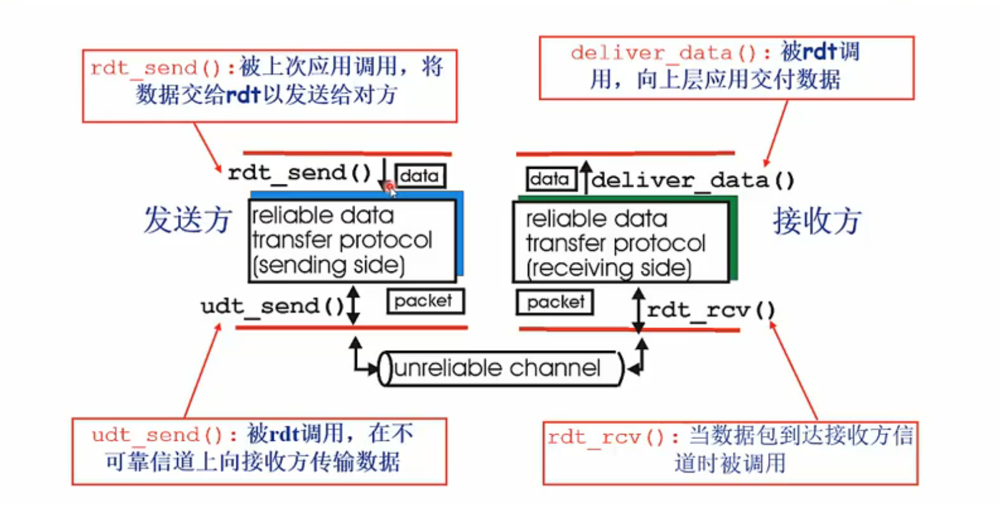
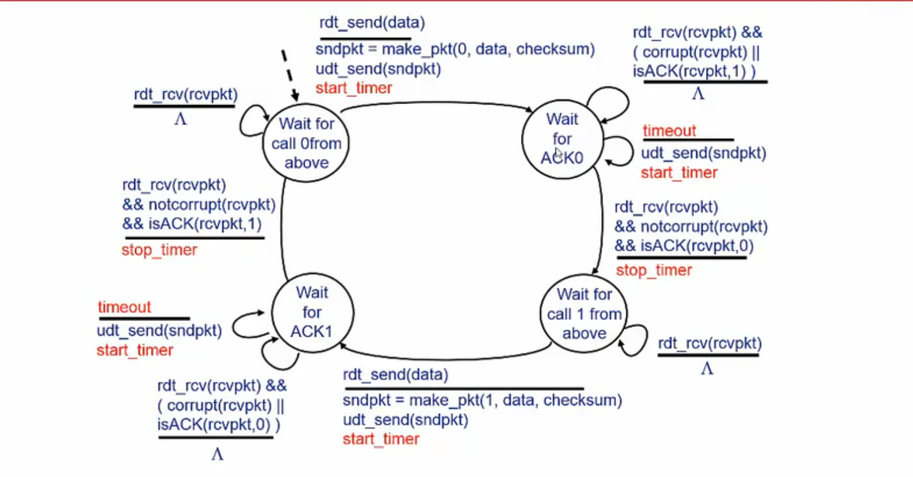
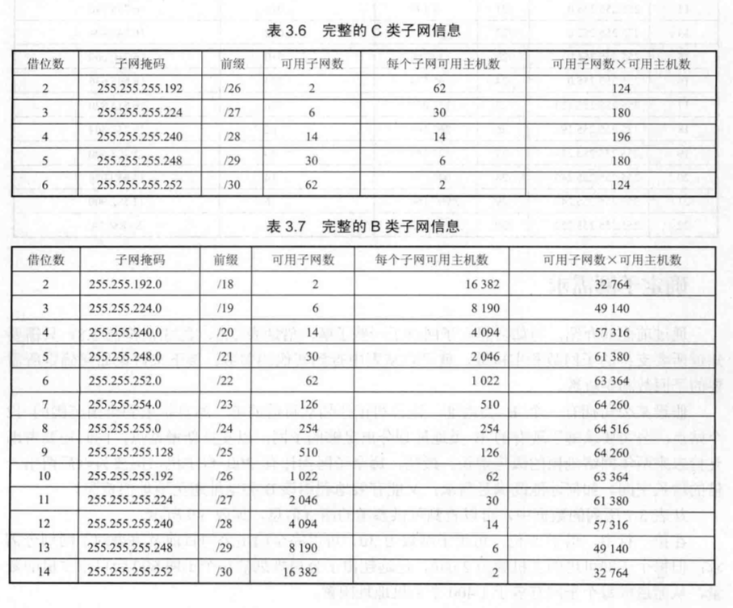
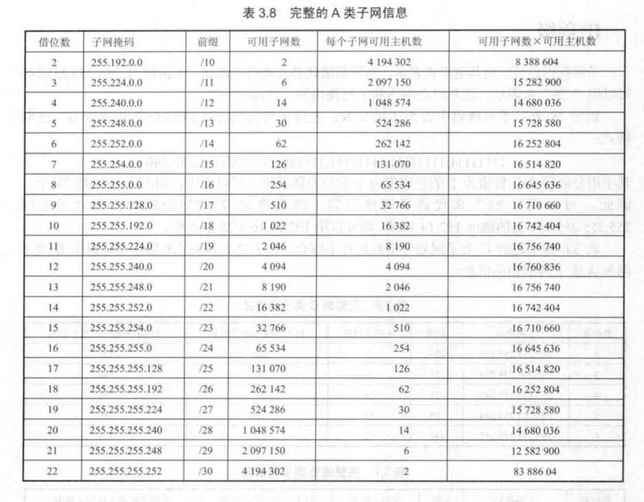

# 计算机网路基础

计算机网络涉及内容广泛，包含不限于网络基础、网络协议、连接硬件、传输媒介、还有相关的机构(ANSI、IOS等)与厂商(华为、IBM等)。在这里，还是介绍计算机网络基础知识及常见的网络协议。我们在使用手机浏览信息其背后都发生了哪些奇妙的事情呢？

两个因特网主机通过两个路由器和对应的层连接。各主机上的应用通过一些数据通道相互执行读取操作。

## 计算机网络思维导图

[计算机网络思维导图(出自网络)](assets/Computer-network-mind-map.pdf)

## OSI模型

提高计算机网路我们首先会想到国际标准化组织曾提出的「开放式系统互联参考模型」（Open System Interconnection）。
OSI是一个定义良好的协议规范集，并有许多可选部分完成类似的任务。它定义了开放系统的层次结构、层次之间的相互关系以及各层所包括的可能的任务，作为一个框架来协调和组织各层所提供的服务。
OSI参考模型并没有提供一个可以实现的方法，而是描述了一些概念，用来协调进程间通信标准的制定。即OSI参考模型并不是一个标准，而是一个在制定标准时所使用的概念性框架。

### 网络层次划分

#### 每一层的作用如下：

- 物理层：在局部局域网上传送帧，它负责管理电脑通信设备和网络媒体之间的互通。包括了针脚、电压、线缆规范、集线器、中继器、网卡、主机适配器等
（比特Bit）

- 数据链路层：将比特组装成帧和点到点的传递（帧Frame）

- 网络层：负责数据包从源到宿的传递和网际互连（包PackeT）

- 传输层：提供端到端的可靠报文传递和错误恢复（段Segment）

- 会话层：建立、管理和终止会话（会话协议数据单元SPDU）

- 表示层：对数据进行翻译、加密和压缩（表示协议数据单元PPDU）

- 应用层：允许访问OSI环境的手段（应用协议数据单元APDU）

#### 每层常见的协议

- 物理层： RJ45 、 CLOCK 、 IEEE802.3 （中继器，集线器，网关）

- 数据链路： PPP 、 FR 、 HDLC 、 VLAN 、 MAC （网桥，交换机）

- 网络层： IP 、 ICMP 、 ARP 、 RARP 、 OSPF 、 IPX 、 RIP 、 IGRP 、 （路由器）

- 传输层： TCP 、 UDP 、 SPX 

- 会话层： SQL 、RPC、SSH、NFS 、NETBIOS 

- 表示层： JPEG 、 MPEG 、 ASII

- 应用层： HTTP 、FTP 、 DNS 、 Telnet 、 SMTP 、 SNMP、 WWW 、 NFS

## 常见协议说明

### 应用层

目前很多互联网公司都是以产品为导向，大部分业务逻辑都在应用层，其主要工作是写出能够运行在不同的端系统和通过网络彼此同心的程序。

#### HTTP

**超文本传输协议**（HyperText Transfer Protocol，缩写：HTTP）是一种用于分布式、协作式和超媒体信息系统的应用层协议。HTTP是万维网的数据通信的基础。
第一个WEB服务页面是由「蒂姆·伯纳斯-李」写出的，也是他推动了万维网的发展，在其组织和社区的维护下，不断更新RFC，最终制定了一系列的标准。如果没有他第一次利用互联网实现了HTTP客户端与服务器通信，也许万维网会晚些年出现。

HTTP是一个客户端终端（用户）和服务器端（网站）请求和应答的标准（TCP）通过使用网页浏览器、网络爬虫或者其它的工具，客户端发起一个HTTP请求到服务器上指定端口（默认端口为80）。我们称这个客户端为用户代理程序（user agent）。应答的服务器上存储着一些资源，比如HTML文件和图像。我们称这个应答服务器为源服务器（origin server）。在用户代理和源服务器中间可能存在多个“中间层”，比如代理服务器、网关或者隧道（tunnel）。

##### HTTP版本

HTTP版本截止目前一共出现了4次大的迭代，包含HTTP/0.9、HTTP/1.0、HTTP/1.1、HTTP/2。现在，一般的服务都是采用后两个，基本上没看到有HTTP/1.0出现了，就更别提HTTP/0.9啦。

**HTTP/1.1**

HTTP/1.1 中持久连接被默认采用，并能很好地配合代理服务器工作。还支持以管道方式在同时发送多个请求，以便降低线路负载，提高传输速度。

**HTTP/2**

HTTP/2 保留了 HTTP/1.1 的大部分语义，例如请求方法、状态码乃至URI和绝大多数HTTP头部字段一致。而 HTTP/2 采用了新的方法来编码、传输客户端——服务器间的数据。

相比 HTTP/1.x，HTTP/2 在底层传输做了很大的改动和优化，新特性如下：

- 对数据传输采用多路复用，让多个请求合并在同一 TCP 连接内

- 可以给请求添加优先级

- 服务器主动推送 server push

- HPACK 算法，用于对HTTP头部做压缩。HTTP2的头部会减小，从而减少流量传输

[扩展阅读](https://en.wikipedia.org/wiki/HTTP/2#HTTP.2F2.E4.B8.8EHTTP.2F1.1.E6.AF.94.E8.BE.83)

##### 请求方法

HTTP/1.1协议中共定义了八种方法（也叫“动作”）来以不同方式操作指定的资源：

- GET

- POST

- PUT

- HEAD

- DELETE

- TRACE

- OPTIONS

- CONNECT

**Safe methods**：其中的一些方法被称为Safe methods，即除了进行获取资源信息外，这些请求不应当再有其他意义。例如：GET、HEAD、OPTIONS。

##### 请求信息

- 请求行
- 请求头
- 空行
- 其他消息体

##### 状态码

	1XX表示请求已经接受了，正在处理

	100  Continue  继续，一般在发送post请求时，已发送了http header之后服务端将返回此信息，表示确认，之后发送具体参数信息

	2XX 表示处理成功接受，处理掉了

	200  OK   正常返回信息

	201  Created  请求成功并且服务器创建了新的资源

	202  Accepted  服务器已接受请求，但尚未处理

	3XX 重定向，比如完成这个操作可能需要重定向，或者更多操作

	301  Moved Permanently  请求的网页已永久移动到新位置。

	302 Found  临时性重定向。

	303 See Other  临时性重定向，且总是使用 GET 请求新的 URI。

	304  Not Modified  自从上次请求后，请求的网页未修改过。

	4XX 客户端错误 请求错误 比如说，语法错误，无法实现

	400 Bad Request  服务器无法理解请求的格式，客户端不应当尝试再次使用相同的内容发起请求。

	401 Unauthorized  请求未授权。

	403 Forbidden  禁止访问。

	404 Not Found  找不到如何与 URI 相匹配的资源。

	5XX可能就是服务器端错误，

	500 Internal Server Error  最常见的服务器端错误。

	503 Service Unavailable 服务器端暂时无法处理请求（可能是过载或维护）。

[HTTP 扩展阅读](https://developer.mozilla.org/zh-CN/docs/Web/HTTP)

#### DNS

域名系统（Domain Name System，缩写：DNS）是互联网的一项服务。它作为将域名和IP地址相互映射的一个分布式数据库，能够使人更方便地访问互联网。DNS使用TCP和UDP端口53。当前，对于每一级域名长度的限制是63个字符，域名总长度则不能超过253个字符。

DNS查询有两种方式：递归和迭代。DNS客户端设置使用的DNS服务器一般都是递归服务器，它负责全权处理客户端的DNS查询请求，直到返回最终结果。而DNS服务器之间一般采用迭代查询方式。

- [http://whois.com](http://whois.com)

##### DNS的脆弱性

- DDoS攻击

##### nslookup 命令

**nslookup** （name server lookup）是一个用于查询 Internet域名信息或诊断DNS 服务器问题的工具。

#### Telnet

Telnet协议是一种应用层协议，使用于互联网及局域网中，使用虚拟终端机的形式，提供双向、以文字字符串为主的交互功能。属于TCP/IP协议族的其中之一，是Internet远程登录服务的标准协议和主要方式，常用于网页服务器的远程控制，可供用户在本地主机运行远程主机上的工作。

##### telnet 命令

#### SMTP

SMTP是一个相对简单的基于文本的协议。在其之上指定了一条消息的一个或多个接收者（在大多数情况下被确认是存在的），然后消息文本会被传输。可以很简单地通过telnet程序来测试一个SMTP服务器。SMTP使用TCP端口25。要为一个给定的域名决定一个SMTP服务器，需要使用MX (Mail eXchange) DNS。

### 传输层

传输层（transport layer）互联网协议包与开放系统互连（OSI）网络堆栈中协议的分层结构中的方法的一个概念划分。该层的协议为应用进程提供端到端的通信服务。[1] 它提供面向连接的数据流支持、可靠性、流量控制、多路复用等服务。最著名的TCP/IP传输协议是传输控制协议（TCP）, 它的名称借用自整个包的名称。它用于面向连接的传输，而无连接的用户数据报协议（UDP）用于简单消息传输。TCP是更复杂的协议，因为它的状态性设计结合了可靠传输和数据流服务。这个协议组中其他重要协议有数据拥塞控制协议（DCCP）与流控制传输协议（SCTP）。

**疑问**

1.什么是可靠？

	不错、不丢、不乱

2.TCP 如何保证数据的可靠性？

#### TCP

传输控制协议（Transmission Control Protocol，缩写为 TCP）是一种面向连接的、可靠的、基于字节流的传输层通信协议，TCP层是位于IP层之上，应用层之下的中间层。应用层向TCP层发送用于网间传输的、用8位字节表示的数据流，然后TCP把数据流分区成适当长度的报文段（通常受该计算机连接的网络的数据链路层的最大传输单元（MTU）的限制）。之后TCP把结果包传给IP层，由它来通过网络将包传送给接收端实体的TCP层。TCP为了保证不发生丢包，就给每个包一个序号，同时序号也保证了传送到接收端实体的包的按序接收。然后接收端实体对已成功收到的包发回一个相应的确认（ACK）；如果发送端实体在合理的往返时延（RTT）内未收到确认，那么对应的数据包就被假设为已丢失将会被进行重传。TCP用一个校验和函数来检验数据是否有错误；在发送和接收时都要计算校验和。

数据在TCP层称为Stream，数据分组称为分段（Segment）。作为比较，数据在IP层称为Datagram，数据分组称为分片（Fragment）。 UDP 中分组称为Message。

##### TCP 运行方式

CP协议的运行可划分为三个阶段：连接创建(connection establishment)、数据传送（data transfer）和连接终止（connection termination）。

**连接创建**

TCP用三路握手（或称三次握手，three-way handshake）过程创建一个连接。在连接创建过程中，很多参数要被初始化，例如序号被初始化以保证按序传输和连接的强壮性。

TCP连接的正常创建
一对终端同时初始化一个它们之间的连接是可能的。但通常是由一端打开一个套接字（socket）然后监听来自另一方的连接，这就是通常所指的被动打开（passive open）。服务器端被被动打开以后，用户端就能开始创建主动打开（active open）。
客户端通过向服务器端发送一个SYN来创建一个主动打开，作为三路握手的一部分。客户端把这段连接的序号设定为随机数A。
服务器端应当为一个合法的SYN回送一个SYN/ACK。ACK的确认码应为A+1，SYN/ACK包本身又有一个随机产生的序号B。
最后，客户端再发送一个ACK。当服务端受到这个ACK的时候，就完成了三路握手，并进入了连接创建状态。此时包的序号被设定为收到的确认号A+1，而响应号则为B+1。

**资源使用**

主机收到一个TCP包时，用两端的IP地址与端口号来标识这个TCP包属于哪个session。使用一张表来存储所有的session，表中的每条称作Transmission Control Block（TCB），tcb结构的定义包括连接使用的源端口、目的端口、目的ip、序号、应答序号、对方窗口大小、己方窗口大小、tcp状态、tcp输入/输出队列、应用层输出队列、tcp的重传有关变量等。

服务器端的连接数量是无限的，只受内存的限制。客户端的连接数量，过去由于在发送第一个SYN到服务器之前需要先分配一个随机空闲的端口，这限制了客户端IP地址的对外发出连接的数量上限。从Linux 4.2开始，有了socket选项IP_BIND_ADDRESS_NO_PORT，它通知Linux内核不保留usingbind使用端口号为0时内部使用的临时端口（ephemeral port），在connect时会自动选择端口以组成独一无二的四元组。
对于不能确认的包、接收但还没读取的数据，都会占用操作系统的资源。

**数据传送**

从图中我们可以看出，数据从应用层出发是单向的，数据被目的主机的应用层接收时也是单向的，但是其内部的传输是在不可靠传输信道上双向传输。

在TCP的数据传送状态，很多重要的机制保证了TCP的可靠性和强壮性。它们包括：**使用序号，对收到的TCP报文段进行排序以及检测重复的数据；使用校验和来检测报文段的错误，即无错传输；使用确认和计时器来检测和纠正丢包或延时；流控制（Flow control）；拥塞控制（Congestion control）；丢失包的重传。**

TCP 如何保证数据的可靠性？ 总结来说，如下:

1.应用数据被分割成TCP认为最合适发送的数据块。这和UDP完全不同，应用程序产生的数据报长度将保持不变。由TCP传递给TP的信息单位被称为报文段或段(segment)

2.当TCP发出一个段后，它启动一个定时器🌚，等待目的端确认收到这个报文段。如果不能及时收到一个确认，将重发这个报文段(自适应的超时重发策略)。

3.当TCP收到发自TCP连接另一端，它将发送一个确认。这个确认不是立即发送，通常将推迟几分之一秒。🥄

4.TCP将保持它首部和数据的检验和🍽。这是一个端到端的检验和，目的是检测数据在传输过程中的任何变化。如收到段的检验和有差错，TCP将丢弃这个报文段和不确认收到此报文段(希望发送端超时重发)。

5.既然TCP报文段作为IP数据报来传输，而IP数据报的到达可能会失序，因此TCP报文段的到达也可能会失序，如果有必要，TCP将对受到的数据进行重新排序🥂，将收到的数据以正确顺序交给应用层。

6.既然IP数据包会发生重复，TCP的接收端必须丢弃重复的数据🍼。

7.TCP还能提供流量控制。TCP连接的每一方都有固定大小的缓存空间🍭。TCP的接受端只允许另一端发送接收端缓存区所能够接纳的数据。这将防止较快主机导致使较慢主机缓存区溢出。

8.TCP还提供拥塞控制：其防止任何一条TCP连接用过多流量来淹没通信主机之间的链路和交换设备。TCP希望各个连接平等的共享网络链路带宽，可以通过调节流量速率做到，UDP流量是不可调节。那么问题来了，如何调节TCP流量速率呢？

**连接终止**

连接终止使用了四路握手过程（或称四次握手，four-way handshake），在这个过程中连接的每一侧都独立地被终止。当一个端点要停止它这一侧的连接，就向对侧发送FIN，对侧回复ACK表示确认。因此，拆掉一侧的连接过程需要一对FIN和ACK，分别由两侧端点发出。

TCP支持的应用协议主要有：HTTP、Telnet、FTP、SMTP等；

**问题**

1.一个TCP发送方如何限制它向其连接发送流量的速率呢？

2.一个TCP发送方如何感知从它到目的地之间的路径之间存在拥塞呢？

3.当发送方感知端到端存在拥塞时，采用何种算法来改变其发送速率呢？

#### UDP

用户数据包协议（User Datagram Protocol，缩写为UDP），又称用户数据报文协议，是一个简单的面向数据报的传输层协议。在TCP/IP模型中，UDP为网络层以上和应用层以下提供了一个简单的接口。UDP只提供数据的不可靠传递，它一旦把应用程序发给网络层的数据发送出去，就不保留数据备份（所以UDP有时候也被认为是不可靠的数据报协议）。UDP在IP数据报的头部仅仅加入了复用和数据校验（字段）

UDP首部字段由4个部分组成，其中两个是可选的。各16bit的来源端口和目的端口用来标记发送和接受的应用进程。因为UDP不需要应答，所以来源端口是可选的，如果来源端口不用，那么置为零。在目的端口后面是长度固定的以字节为单位的长度域，用来指定UDP数据报包括数据部分的长度，长度最小值为8byte。首部剩下地16bit是用来对首部和数据部分一起做校验和（Checksum）的，这部分是可选的，但在实际应用中一般都使用这一功能。

由于缺乏可靠性且属于非连接导向协议，UDP应用一般必须允许一定量的丢包、出错和复制粘贴。但有些应用，比如TFTP，如果需要则必须在应用层增加根本的可靠机制。但是绝大多数UDP应用都不需要可靠机制，甚至可能因为引入可靠机制而降低性能。流媒体（流技术）、即时多媒体游戏和IP电话（VoIP）一定就是典型的UDP应用。如果某个应用需要很高的可靠性，那么可以用传输控制协议（TCP协议）来代替UDP。

由于缺乏拥塞控制（congestion control），需要基于网络的机制来减少因失控和高速UDP流量负荷而导致的拥塞崩溃效应。换句话说，因为UDP发送者不能够检测拥塞，所以像使用包队列和丢弃技术的路由器这样的网络基本设备往往就成为降低UDP过大通信量的有效工具。数据报拥塞控制协议（DCCP）设计成通过在诸如流媒体类型的高速率UDP流中，增加主机拥塞控制，来减小这个潜在的问题。

典型网络上的众多使用UDP协议的关键应用一定程度上是相似的。这些应用包括域名系统（DNS）、NFS（网络文件系统）、简单网络管理协议（SNMP）、TFTP（通用文件传输协议）、动态主机配置协议（DHCP）、路由信息协议（RIP）和某些影音流服务等等。

#### TCP与UDP区别

### 网络层

网络层（Network Layer）提供路由和寻址的功能，使两终端系统能够互连且决定最佳路径，并具有一定的拥塞控制和流量控制的能力。由于TCP/IP协议体系中的网络层功能由IP协议规定和实现，故又称IP层。

**学期网路层的一些疑问**

1.运输层能够指望网络层将分组交付给目的吗？

2.当发送多个分组时，他们会按时发送顺序交付给接受主机的运输层吗？

3.发送两个连续分组的时间间隔与接收两个分组的时间间隔相同吗？

4.网络层会提供关于网络中拥塞反馈信息吗？

5.在发送主机与接收主机中连接运输层的通道抽象视图是什么？

**主要功能**

- 转发：当一个分组到达路由器的一条输入链路时，路由器必须该分组移动到适当的输出链路。

- 路由选择：当分组从发送方流向接收方时，网络层必须决定这些分组采用的路由或路径。（详见路由选择算法）

- 连接建立：从源到目的地连接中的网络层数据分组能够开始流动之前建立起状态。

#### IP

IP是在TCP/IP协议中网络层的主要协议，任务是仅仅根据源主机和目的主机的地址传送数据。为此目的，IP定义了寻址方法和数据报的封装结构，其中最为复杂可能就是寻址和路由了。寻址就是如何将IP地址分配给各个终端节点，以及如何划分和组合子网。所有网络端点都需要路由，尤其是网际之间的路由器。路由器通常用内部网关协议（Interior Gateway Protocols，IGPs）和外部网关协议（External Gateway Protocols，EGPs）决定怎样发送IP数据包。

#### IPv4

IPv4是一种无连接的协议，操作在使用分组交换的链路层（如以太网）上。此协议会尽最大努力交付分组，意即它不保证任何分组均能送达目的地，也不保证所有分组均按照正确的顺序无重复地到达。这些方面是由上层的传输协议（如传输控制协议）处理的。

**地址**

IPv4使用32位（4字节）地址，因此地址空间中只有（232）个地址，约40亿（4 * 210），其中还包含了专用网络地址(约1800W)和多播地址(约2.7亿)。

**地址格式**

IPv4地址可被写作任何表示一个32位整数值的形式，但为了方便人类阅读和分析，它通常被写作点分十进制的形式，即四个字节被分开用十进制写出，中间用点分隔。

**无类别域间路由(CIDR)**

这个系统重新定义了分类网络(有类别域间路由)，五个类别分别为：A、B、C、D和E。D类被用于多播地址，E类被留作将来使用。

一个IP地址被分成两部分：网络号（包括子网号）和主机号组成，网络地址的主机号为全0，网络地址代表着整个网络。

CIDR主要是一个按位的、基于前缀的，用于解释IP地址的标准。它通过把多个地址块组合到一个路由表表项而使得路由更加方便。这些地址块叫做CIDR地址块。当用二进制表示这些地址时，它们有着在开头部分的一系列相同的位。

IPv4的CIDR地址块的表示方法和IPv4地址的表示方法是相似的：由四部分组成的点分十进制地址，后跟一个斜线，最后是范围在0到32之间的一个数字：A.B.C.D/N。点分十进制的部分和IPv4地址一样是一个被分成四个八位位组的32位二进制数。斜线后面的数字就是前缀长度，也就是从左到右，被地址块里的地址所共享的位的数目。当只需说明大概时，十进制部分有时会被省略，因此，/20就表示一个前缀长度是20的CIDR地址块。

如果一个IP地址的前N位与一个CIDR地址块的前缀是相同的话，那么就说这个地址属于这个CIDR地址块，也可以说是与CIDR地址块的前缀匹配。所以，要理解CIDR，就要把地址写成二进制的形式。

因为IPv4地址的长度总是32位，N位长的CIDR前缀就意味着地址里 32-N 位不匹配。这些位有 2^(32-N) 种不同的组合，即 2^(32-N) 个IPv4地址与CIDR地址块的前缀匹配。前缀越短就能匹配越多的地址，越长就匹配得越少。一个地址可能与多个长度不同的CIDR前缀匹配。

CIDR也用在IPv6中。因为位数的非常多，所以在IPv6中，前缀长度的范围是从0到128。这里也用同样的方法来表示一个地址：前缀写作一个IPv6的地址，后跟一个斜线，最后是前缀的位数。

A类地址以0开头，第一个字节作为网络号，地址范围为：0.0.0.0~127.255.255.255

B类地址以10开头，前两个字节作为网络号，地址范围是：128.0.0.0~191.255.255.255

C类地址以110开头，前三个字节作为网络号，地址范围是：192.0.0.0~223.255.255.255。

D类地址以1110开头，地址范围是224.0.0.0~239.255.255.255，D类地址作为组播地址（一对多的通信）

E类地址以1111开头，地址范围是240.0.0.0~255.255.255.255，E类地址为保留地址，供以后使用
　　
注：只有A,B,C有网络号和主机号之分，D类地址和E类地址没有划分网络号和主机号。

**CIDR和掩码**

子网掩码是一种把前缀编成一种与IP地址相似的形式的掩码。一个子网掩码一共有32位，被分为连续的两部分，高位部分的每一位都被设为二进制的1，其余部分的每一位均被设为二进制的0。其中为1的位的数目和前缀的长度相同。它也被写成点分十进制的形式。子网掩码的作用和前缀一样，但是掩码这种形式出现得比前缀要早。

**255.255.255.255**

该IP地址指的是受限的广播地址。受限广播地址与一般广播地址（直接广播地址）的区别在于，受限广播地址只能用于本地网络，路由器不会转发以受限广播地址为目的地址的分组；一般广播地址既可在本地广播，也可跨网段广播。例如：主机192.168.1.1/30上的直接广播数据包后，另外一个网段192.168.1.5/30也能收到该数据报；若发送受限广播数据报，则不能收到。一般的广播地址（直接广播地址）能够通过某些路由器（当然不是所有的路由器），而受限的广播地址不能通过路由器。

**0.0.0.0**

常用于寻找自己的IP地址，例如在我们的RARP，BOOTP和DHCP协议中，若某个未知IP地址的无盘机想要知道自己的IP地址，它就以255.255.255.255为目的地址，向本地范围（具体而言是被各个路由器屏蔽的范围内）的服务器发送IP请求分组。

**回环地址**

127.0.0.0/8被用作回环地址，回环地址表示本机的地址，常用于对本机的测试，用的最多的是127.0.0.1。

**A、B、C类私有地址**

名字 |	地址范围	| 地址数量 |	有类别的描述	最大的CIDR地址块
---- | ---- | ----- | ------
24位块	| 10.0.0.0–10.255.255.255	| 16,777,216	| 一个A类	10.0.0.0/8
20位块	| 172.16.0.0–172.31.255.255	 | 1,048,576	| 连续的16个B类	172.16.0.0/12
16位块	| 192.168.0.0–192.168.255.255	 | 65,536	| 连续的256个C类	192.168.0.0/16

#### 子网

<!-- 借位数 | 子网掩码 | 前缀 | 可用子网数 | 每个子网可用主机数 | 可用子网数 ✖ 用主机数
-----| ------- | ----- | -------- | ---------------- |------------
 -->

#### IPv6

IPv6采用了128位的地址，地址空间支持2128（约3.4×1038）个地址，是IPv4地址长度的4倍。Pv6有3种表示方法。

  1.冒分十六进制表示法 //格式为X:X:X:X:X:X:X:X

  2.0位压缩表示法

  3.内嵌IPv4地址表示法

  相比IPv4特点

  IPv6具有更大的地址空间、更小的路由表、主机地址自动配置、具有更高的安全性、良好的扩展性、简化的报文头格式

[扩展阅读](https://zh.wikipedia.org/wiki/IPv6)

#### ICMP

互联网控制消息协议（Internet Control Message Protocol，ICMP）是互联网协议族的核心协议之一。它用于TCP/IP网络中发送控制消息，提供可能发生在通信环境中的各种问题反馈，通过这些信息，令管理者可以对所发生的问题作出诊断，然后采取适当的措施解决。

ICMP 依靠IP来完成它的任务，它是IP的主要部分。它与传输协议，如TCP和UDP显著不同：它一般不用于在两点间传输数据。它通常不由网络程序直接使用，除了ping和traceroute这两个特别的例子。 IPv4中的ICMP被称作ICMPv4，IPv6中的ICMP则被称作ICMPv6。

#### ARP

地址解析协议，即ARP（Address Resolution Protocol），是根据IP地址获取物理地址的一个TCP/IP协议。主机发送信息时将包含目标IP地址的ARP请求广播到网络上的所有主机，并接收返回消息，以此确定目标的物理地址；收到返回消息后将该IP地址和物理地址存入本机ARP缓存中并保留一定时间，下次请求时直接查询ARP缓存以节约资源。地址解析协议是建立在网络中各个主机互相信任的基础上的，网络上的主机可以自主发送ARP应答消息，其他主机收到应答报文时不会检测该报文的真实性就会将其记入本机ARP缓存；由此攻击者就可以向某一主机发送伪ARP应答报文，使其发送的信息无法到达预期的主机或到达错误的主机，这就构成了一个ARP欺骗。

ARP命令可用于查询本机ARP缓存中IP地址和MAC地址的对应关系、添加或删除静态对应关系等。

**ARP工作流程举例：**

主机A的IP地址为192.168.1.1，MAC地址为0A-11-22-33-44-01；
主机B的IP地址为192.168.1.2，MAC地址为0A-11-22-33-44-02；

当主机A要与主机B通信时，地址解析协议可以将主机B的IP地址（192.168.1.2）解析成主机B的MAC地址，以下为工作流程：

- 根据主机A上的路由表内容，IP确定用于访问主机B的转发IP地址是192.168.1.2。然后A主机在自己的本地ARP缓存中检查主机B的匹配MAC地址。

- 如果主机A在ARP缓存中没有找到映射，它将询问192.168.1.2的硬件地址，从而将ARP请求帧广播到本地网络上的所有主机。源主机A的IP地址和MAC地址都包括在ARP请求中。本地网络上的每台主机都接收到ARP请求并且检查是否与自己的IP地址匹配。如果主机发现请求的IP地址与自己的IP地址不匹配，它将丢弃ARP请求。

- 主机B确定ARP请求中的IP地址与自己的IP地址匹配，则将主机A的IP地址和MAC地址映射添加到本地ARP缓存中。

- 主机B将包含其MAC地址的ARP回复消息直接发送回主机A。

- 当主机A收到从主机B发来的ARP回复消息时，会用主机B的IP和MAC地址映射更新ARP缓存。本机缓存是有生存期的，生存期结束后，将再次重复上面的过程。主机B的MAC地址一旦确定，主机A就能向主机B发送IP通信了。
　

#### RARP

逆地址解析协议，即RARP，功能和ARP协议相对，其将局域网中某个主机的物理地址转换为IP地址，比如局域网中有一台主机只知道物理地址而不知道IP地址，那么可以通过RARP协议发出征求自身IP地址的广播请求，然后由RARP服务器负责回答。
　　
RARP协议工作流程：

- 给主机发送一个本地的RARP广播，在此广播包中，声明自己的MAC地址并且请求任何收到此请求的RARP服务器分配一个IP地址；

- 本地网段上的RARP服务器收到此请求后，检查其RARP列表，查找该MAC地址对应的IP地址；

- 如果存在，RARP服务器就给源主机发送一个响应数据包并将此IP地址提供给对方主机使用；

- 如果不存在，RARP服务器对此不做任何的响应；

- 源主机收到从RARP服务器的响应信息，就利用得到的IP地址进行通讯；如果一直没有收到RARP服务器的响应信息，表示初始化失败。

#### 路由选择协议

常见的路由选择协议有：RIP协议、OSPF协议。

- RIP协议 ：底层是贝尔曼福特算法，它选择路由的度量标准（metric)是跳数，最大跳数是15跳，如果大于15跳，它就会丢弃数据包。

- OSPF协议 ：Open Shortest Path First开放式最短路径优先，底层是迪杰斯特拉算法，是链路状态路由选择协议，它选择路由的度量标准是带宽，延迟。

#### 网络地址转换

网络地址转换（Network Address Translation，缩写为NAT），也叫做网络掩蔽或者IP掩蔽（IP masquerading），是一种在IP数据包通过路由器或防火墙时重写来源IP地址或目的IP地址的技术。这种技术普遍使用在有多台主机但只通过一个公有IP地址访问因特网的私有网络中。根据规范，路由器是不能这样工作，但它的确是一个方便且得到了广泛应用的技术。当然，NAT也让主机之间的通信变得复杂，导致降低了通信效率。

无NAT网络，假设每个接入子网都需要一组/24的IP，而且还能对外连接，对外的路由至少要保留或申请1000个对外IP。

带NAT网络，通过NAT转换，接入子网可以使用私用IP，对外连接时由路由绑定私用IP与对外IP的关系，修改传输的IP包上的地址，从而只需要255个对外IP就能满足内部接入子网的对外连接需求

[扩展阅读](https://zh.wikipedia.org/wiki/%E7%BD%91%E7%BB%9C%E5%9C%B0%E5%9D%80%E8%BD%AC%E6%8D%A2)

#### 路由器工作原理

路由器是一种多端口设备，它可以连接不同传输速率并运行于各种环境的局域网和广域网，也可以采用不同的协议。路由器属于OSI 模型的第三层--网络层。指导从一个网段到另一个网段的数据传输，也能指导从一种网络向另一种网络的数据传输。

**工作原理示例**

- 工作站A将工作站B的地址12.0.0.5连同数据信息以数据包的形式发送给路由器1。

- 路由器1收到工作站A的数据包后，先从包头中取出地址12.0.0.5，并根据路径表计算出发往工作站B的最佳路径：R1->R2->R5->B；并将数据包发往路由器2。

- 路由器2重复路由器1的工作，并将数据包转发给路由器5。

- 路由器5同样取出目的地址，发现12.0.0.5就在该路由器所连接的网段上，于是将该数据包直接交给工作站B。

- 工作站B收到工作站A的数据包，一次通信过程宣告结束。

**作用功能**

- 连通不同的网络
	从过滤网络流量的角度来看，路由器的作用与交换机和网桥非常相似。但是与工作在网络物理层，从物理上划分网段的交换机不同，路由器使用专门的软件协议从逻辑上对整个网络进行划分。

- 信息传输
	有的路由器仅支持单一协议，但大部分路由器可以支持多种协议的传输，即多协议路由器。由于每一种协议都有自己的规则，要在一个路由器中完成多种协议的算法，势必会降低路由器的性能。路由器的主要工作就是为经过路由器的每个数据帧寻找一条最佳传输路径，并将该数据有效地传送到目的站点。由此可见，选择最佳路径的策略即路由算法是路由器的关键所在。为了完成这项工作，在路由器中保存着各种传输路径的相关数据－－路径表（Routing Table），供路由选择时使用。路径表中保存着子网的标志信息、网上路由器的个数和下一个路由器的名字等内容。路径表可以是由系统管理员固定设置好的。

### 数据链路层和物理层

数据链路层：将比特组装成帧和点到点的传递（帧Frame）

#### DHCP

DHCP动态主机设置协议（Dynamic Host Configuration Protocol）是一个局域网的网络协议，使用UDP协议工作，主要有两个用途：给内部网络或网络服务供应商自动分配IP地址，给用户或者内部网络管理员作为对所有计算机作中央管理的手段。

