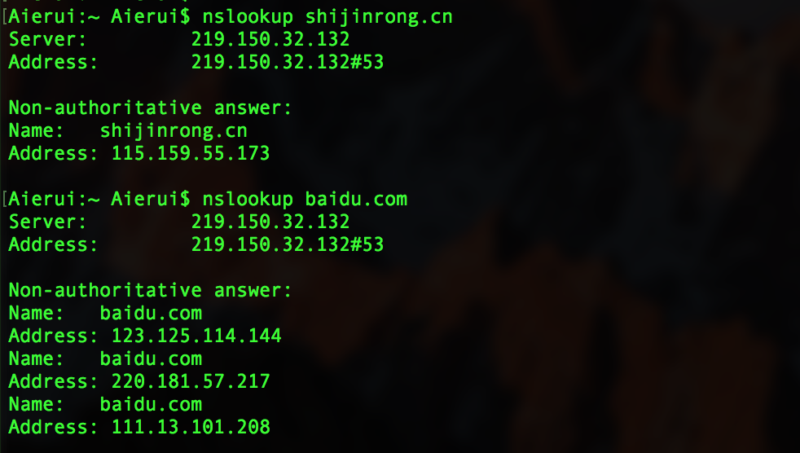
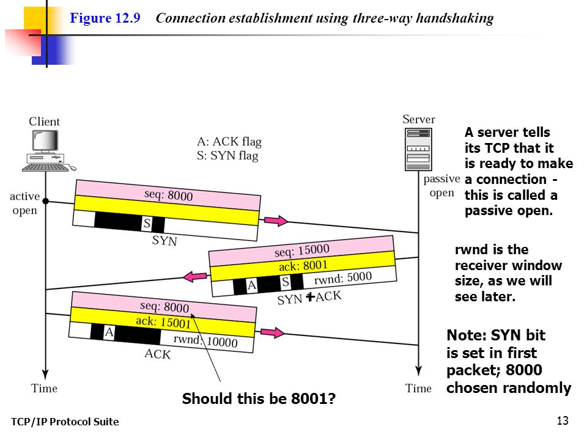

# 计算机网路基础

## OSI模型

提高计算机网路我们首先会想到国际标准化组织曾提出的「开放式系统互联参考模型」（Open System Interconnection）。
OSI是一个定义良好的协议规范集，并有许多可选部分完成类似的任务。它定义了开放系统的层次结构、层次之间的相互关系以及各层所包括的可能的任务，作为一个框架来协调和组织各层所提供的服务。
OSI参考模型并没有提供一个可以实现的方法，而是描述了一些概念，用来协调进程间通信标准的制定。即OSI参考模型并不是一个标准，而是一个在制定标准时所使用的概念性框架。

### 网络层次划分

#### 每一层的作用如下：

- 物理层：在局部局域网上传送帧，它负责管理电脑通信设备和网络媒体之间的互通。包括了针脚、电压、线缆规范、集线器、中继器、网卡、主机适配器等
（比特Bit）

- 数据链路层：将比特组装成帧和点到点的传递（帧Frame）

- 网络层：负责数据包从源到宿的传递和网际互连（包PackeT）

- 传输层：提供端到端的可靠报文传递和错误恢复（段Segment）

- 会话层：建立、管理和终止会话（会话协议数据单元SPDU）

- 表示层：对数据进行翻译、加密和压缩（表示协议数据单元PPDU）

- 应用层：允许访问OSI环境的手段（应用协议数据单元APDU）

#### 每层常见的协议

- 物理层： RJ45 、 CLOCK 、 IEEE802.3 （中继器，集线器，网关）

- 数据链路： PPP 、 FR 、 HDLC 、 VLAN 、 MAC （网桥，交换机）

- 网络层： IP 、 ICMP 、 ARP 、 RARP 、 OSPF 、 IPX 、 RIP 、 IGRP 、 （路由器）

- 传输层： TCP 、 UDP 、 SPX 

- 会话层： SQL 、RPC、SSH、NFS 、NETBIOS 

- 表示层： JPEG 、 MPEG 、 ASII

- 应用层： HTTP 、FTP 、 DNS 、 Telnet 、 SMTP 、 SNMP、 WWW 、 NFS

## 常见协议说明

### 应用层

目前很多互联网公司都是以产品为导向，大部分业务逻辑都在应用层，其主要工作是写出能够运行在不同的端系统和通过网络彼此同心的程序。

#### HTTP

**超文本传输协议**（HyperText Transfer Protocol，缩写：HTTP）是一种用于分布式、协作式和超媒体信息系统的应用层协议。HTTP是万维网的数据通信的基础。
第一个WEB服务页面是由「蒂姆·伯纳斯-李」写出的，也是他推动了万维网的发展，在其组织和社区的维护下，不断更新RFC，最终制定了一系列的标准。如果没有他第一次利用互联网实现了HTTP客户端与服务器通信，也许万维网会晚些年出现。

HTTP是一个客户端终端（用户）和服务器端（网站）请求和应答的标准（TCP）通过使用网页浏览器、网络爬虫或者其它的工具，客户端发起一个HTTP请求到服务器上指定端口（默认端口为80）。我们称这个客户端为用户代理程序（user agent）。应答的服务器上存储着一些资源，比如HTML文件和图像。我们称这个应答服务器为源服务器（origin server）。在用户代理和源服务器中间可能存在多个“中间层”，比如代理服务器、网关或者隧道（tunnel）。

##### HTTP版本

HTTP版本截止目前一共出现了4次大的迭代，包含HTTP/0.9、HTTP/1.0、HTTP/1.1、HTTP/2。现在，一般的服务都是采用后两个，基本上没看到有HTTP/1.0出现了，就更别提HTTP/0.9啦。

**HTTP/1.1**

HTTP/1.1 中持久连接被默认采用，并能很好地配合代理服务器工作。还支持以管道方式在同时发送多个请求，以便降低线路负载，提高传输速度。

**HTTP/2**

HTTP/2 保留了 HTTP/1.1 的大部分语义，例如请求方法、状态码乃至URI和绝大多数HTTP头部字段一致。而 HTTP/2 采用了新的方法来编码、传输客户端——服务器间的数据。

相比 HTTP/1.x，HTTP/2 在底层传输做了很大的改动和优化，新特性如下：

	- 对数据传输采用多路复用，让多个请求合并在同一 TCP 连接内

	- 可以给请求添加优先级

	- 服务器主动推送 server push

	- HPACK 算法，用于对HTTP头部做压缩。HTTP2的头部会减小，从而减少流量传输

[扩展阅读](https://en.wikipedia.org/wiki/HTTP/2#HTTP.2F2.E4.B8.8EHTTP.2F1.1.E6.AF.94.E8.BE.83)

##### 请求方法

HTTP/1.1协议中共定义了八种方法（也叫“动作”）来以不同方式操作指定的资源：

- GET

- POST

- PUT

- HEAD

- DELETE

- TRACE

- OPTIONS

- CONNECT

**Safe methods**：其中的一些方法被称为Safe methods，即除了进行获取资源信息外，这些请求不应当再有其他意义。例如：GET、HEAD、OPTIONS。

##### 请求信息

- 请求行
- 请求头
- 空行
- 其他消息体

##### 状态码

	1XX表示请求已经接受了，正在处理

	100  Continue  继续，一般在发送post请求时，已发送了http header之后服务端将返回此信息，表示确认，之后发送具体参数信息

	2XX 表示处理成功接受，处理掉了

	200  OK   正常返回信息

	201  Created  请求成功并且服务器创建了新的资源

	202  Accepted  服务器已接受请求，但尚未处理

	3XX 重定向，比如完成这个操作可能需要重定向，或者更多操作

	301  Moved Permanently  请求的网页已永久移动到新位置。

	302 Found  临时性重定向。

	303 See Other  临时性重定向，且总是使用 GET 请求新的 URI。

	304  Not Modified  自从上次请求后，请求的网页未修改过。

	4XX 客户端错误 请求错误 比如说，语法错误，无法实现

	400 Bad Request  服务器无法理解请求的格式，客户端不应当尝试再次使用相同的内容发起请求。

	401 Unauthorized  请求未授权。

	403 Forbidden  禁止访问。

	404 Not Found  找不到如何与 URI 相匹配的资源。

	5XX可能就是服务器端错误，

	500 Internal Server Error  最常见的服务器端错误。

	503 Service Unavailable 服务器端暂时无法处理请求（可能是过载或维护）。

[HTTP 扩展阅读](https://developer.mozilla.org/zh-CN/docs/Web/HTTP)

#### DNS

域名系统（Domain Name System，缩写：DNS）是互联网的一项服务。它作为将域名和IP地址相互映射的一个分布式数据库，能够使人更方便地访问互联网。DNS使用TCP和UDP端口53。当前，对于每一级域名长度的限制是63个字符，域名总长度则不能超过253个字符。

DNS查询有两种方式：递归和迭代。DNS客户端设置使用的DNS服务器一般都是递归服务器，它负责全权处理客户端的DNS查询请求，直到返回最终结果。而DNS服务器之间一般采用迭代查询方式。

- [http://whois.com](http://whois.com)

##### DNS的脆弱性

- DDoS攻击

##### nslookup 命令

**nslookup** （name server lookup）是一个用于查询 Internet域名信息或诊断DNS 服务器问题的工具。

#### Telnet

Telnet协议是一种应用层协议，使用于互联网及局域网中，使用虚拟终端机的形式，提供双向、以文字字符串为主的交互功能。属于TCP/IP协议族的其中之一，是Internet远程登录服务的标准协议和主要方式，常用于网页服务器的远程控制，可供用户在本地主机运行远程主机上的工作。

##### telnet 命令

#### SMTP

SMTP是一个相对简单的基于文本的协议。在其之上指定了一条消息的一个或多个接收者（在大多数情况下被确认是存在的），然后消息文本会被传输。可以很简单地通过telnet程序来测试一个SMTP服务器。SMTP使用TCP端口25。要为一个给定的域名决定一个SMTP服务器，需要使用MX (Mail eXchange) DNS。

### 传输层

传输层（transport layer）互联网协议包与开放系统互连（OSI）网络堆栈中协议的分层结构中的方法的一个概念划分。该层的协议为应用进程提供端到端的通信服务。[1] 它提供面向连接的数据流支持、可靠性、流量控制、多路复用等服务。最著名的TCP/IP传输协议是传输控制协议（TCP）, 它的名称借用自整个包的名称。它用于面向连接的传输，而无连接的用户数据报协议（UDP）用于简单消息传输。TCP是更复杂的协议，因为它的状态性设计结合了可靠传输和数据流服务。这个协议组中其他重要协议有数据拥塞控制协议（DCCP）与流控制传输协议（SCTP）。

#### TCP

传输控制协议（Transmission Control Protocol，缩写为 TCP）是一种面向连接的、可靠的、基于字节流的传输层通信协议，TCP层是位于IP层之上，应用层之下的中间层。应用层向TCP层发送用于网间传输的、用8位字节表示的数据流，然后TCP把数据流分区成适当长度的报文段（通常受该计算机连接的网络的数据链路层的最大传输单元（MTU）的限制）。之后TCP把结果包传给IP层，由它来通过网络将包传送给接收端实体的TCP层。TCP为了保证不发生丢包，就给每个包一个序号，同时序号也保证了传送到接收端实体的包的按序接收。然后接收端实体对已成功收到的包发回一个相应的确认（ACK）；如果发送端实体在合理的往返时延（RTT）内未收到确认，那么对应的数据包就被假设为已丢失将会被进行重传。TCP用一个校验和函数来检验数据是否有错误；在发送和接收时都要计算校验和。

数据在TCP层称为Stream，数据分组称为分段（Segment）。作为比较，数据在IP层称为Datagram，数据分组称为分片（Fragment）。 UDP 中分组称为Message。

##### TCP 运行方式

CP协议的运行可划分为三个阶段：连接创建(connection establishment)、数据传送（data transfer）和连接终止（connection termination）。

**连接创建**

TCP用三路握手（或称三次握手，three-way handshake）过程创建一个连接。在连接创建过程中，很多参数要被初始化，例如序号被初始化以保证按序传输和连接的强壮性。

TCP连接的正常创建
一对终端同时初始化一个它们之间的连接是可能的。但通常是由一端打开一个套接字（socket）然后监听来自另一方的连接，这就是通常所指的被动打开（passive open）。服务器端被被动打开以后，用户端就能开始创建主动打开（active open）。
客户端通过向服务器端发送一个SYN来创建一个主动打开，作为三路握手的一部分。客户端把这段连接的序号设定为随机数A。
服务器端应当为一个合法的SYN回送一个SYN/ACK。ACK的确认码应为A+1，SYN/ACK包本身又有一个随机产生的序号B。
最后，客户端再发送一个ACK。当服务端受到这个ACK的时候，就完成了三路握手，并进入了连接创建状态。此时包的序号被设定为收到的确认号A+1，而响应号则为B+1。

**资源使用**

主机收到一个TCP包时，用两端的IP地址与端口号来标识这个TCP包属于哪个session。使用一张表来存储所有的session，表中的每条称作Transmission Control Block（TCB），tcb结构的定义包括连接使用的源端口、目的端口、目的ip、序号、应答序号、对方窗口大小、己方窗口大小、tcp状态、tcp输入/输出队列、应用层输出队列、tcp的重传有关变量等。

服务器端的连接数量是无限的，只受内存的限制。客户端的连接数量，过去由于在发送第一个SYN到服务器之前需要先分配一个随机空闲的端口，这限制了客户端IP地址的对外发出连接的数量上限。从Linux 4.2开始，有了socket选项IP_BIND_ADDRESS_NO_PORT，它通知Linux内核不保留usingbind使用端口号为0时内部使用的临时端口（ephemeral port），在connect时会自动选择端口以组成独一无二的四元组。
对于不能确认的包、接收但还没读取的数据，都会占用操作系统的资源。

**数据传送**

在TCP的数据传送状态，很多重要的机制保证了TCP的可靠性和强壮性。它们包括：使用序号，对收到的TCP报文段进行排序以及检测重复的数据；使用校验和来检测报文段的错误，即无错传输；使用确认和计时器来检测和纠正丢包或延时；流控制（Flow control）；拥塞控制（Congestion control）；丢失包的重传。

TCP 如何保证数据的可靠性？ 总结来说，如下:

1.应用数据被分割成TCP认为最合适发送的数据块。这和UDP完全不同，应用程序产生的数据报长度将保持不变。由TCP传递给TP的信息单位被称为报文段或段(segment)

2.当TCP发出一个段后，它启动一个定时器🌚，等待目的端确认收到这个报文段。如果不能及时收到一个确认，将重发这个报文段(自适应的超时重发策略)。

3.当TCP收到发自TCP连接另一端，它将发送一个确认。这个确认不是立即发送，通常将推迟几分之一秒。🥄

4.TCP将保持它首部和数据的检验和🍽。这是一个端到端的检验和，目的是检测数据在传输过程中的任何变化。如收到段的检验和有差错，TCP将丢弃这个报文段和不确认收到此报文段(希望发送端超时重发)。

5.既然TCP报文段作为IP数据报来传输，而IP数据报的到达可能会失序，因此TCP报文段的到达也可能会失序，如果有必要，TCP将对受到的数据进行重新排序🥂，将收到的数据以正确顺序交给应用层。

6.既然IP数据包会发生重复，TCP的接收端必须丢弃重复的数据🍼。

7.TCP还能提供流量控制。TCP连接的每一方都有固定大小的缓存空间🍭。TCP的接受端只允许另一端发送接收端缓存区所能够接纳的数据。这将防止较快主机导致使较慢主机缓存区溢出。

8.TCP还提供拥塞控制：其防止任何一条TCP连接用过多流量来淹没通信主机之间的链路和交换设备。TCP希望各个连接平等的共享网络链路带宽，可以通过调节流量速率做到，UDP流量是不可调节。那么问题来了，如何调节TCP流量速率呢？

**连接终止**

连接终止使用了四路握手过程（或称四次握手，four-way handshake），在这个过程中连接的每一侧都独立地被终止。当一个端点要停止它这一侧的连接，就向对侧发送FIN，对侧回复ACK表示确认。因此，拆掉一侧的连接过程需要一对FIN和ACK，分别由两侧端点发出。

TCP支持的应用协议主要有：HTTP、Telnet、FTP、SMTP等；

#### UDP

用户数据包协议（User Datagram Protocol，缩写为UDP），又称用户数据报文协议，是一个简单的面向数据报的传输层协议。在TCP/IP模型中，UDP为网络层以上和应用层以下提供了一个简单的接口。UDP只提供数据的不可靠传递，它一旦把应用程序发给网络层的数据发送出去，就不保留数据备份（所以UDP有时候也被认为是不可靠的数据报协议）。UDP在IP数据报的头部仅仅加入了复用和数据校验（字段）

UDP首部字段由4个部分组成，其中两个是可选的。各16bit的来源端口和目的端口用来标记发送和接受的应用进程。因为UDP不需要应答，所以来源端口是可选的，如果来源端口不用，那么置为零。在目的端口后面是长度固定的以字节为单位的长度域，用来指定UDP数据报包括数据部分的长度，长度最小值为8byte。首部剩下地16bit是用来对首部和数据部分一起做校验和（Checksum）的，这部分是可选的，但在实际应用中一般都使用这一功能。

由于缺乏可靠性且属于非连接导向协议，UDP应用一般必须允许一定量的丢包、出错和复制粘贴。但有些应用，比如TFTP，如果需要则必须在应用层增加根本的可靠机制。但是绝大多数UDP应用都不需要可靠机制，甚至可能因为引入可靠机制而降低性能。流媒体（流技术）、即时多媒体游戏和IP电话（VoIP）一定就是典型的UDP应用。如果某个应用需要很高的可靠性，那么可以用传输控制协议（TCP协议）来代替UDP。

由于缺乏拥塞控制（congestion control），需要基于网络的机制来减少因失控和高速UDP流量负荷而导致的拥塞崩溃效应。换句话说，因为UDP发送者不能够检测拥塞，所以像使用包队列和丢弃技术的路由器这样的网络基本设备往往就成为降低UDP过大通信量的有效工具。数据报拥塞控制协议（DCCP）设计成通过在诸如流媒体类型的高速率UDP流中，增加主机拥塞控制，来减小这个潜在的问题。

典型网络上的众多使用UDP协议的关键应用一定程度上是相似的。这些应用包括域名系统（DNS）、NFS（网络文件系统）、简单网络管理协议（SNMP）、TFTP（通用文件传输协议）、动态主机配置协议（DHCP）、路由信息协议（RIP）和某些影音流服务等等。

#### TCP与UDP区别

### 网络层

lei

### 数据链路层和物理层

